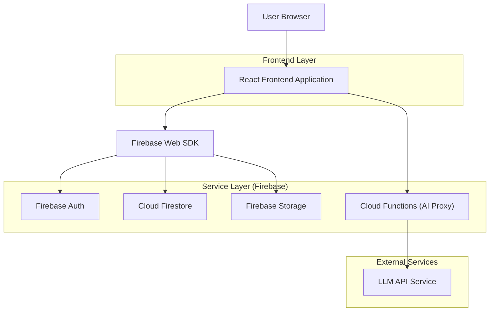
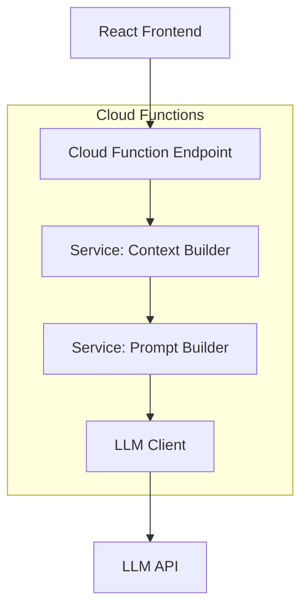
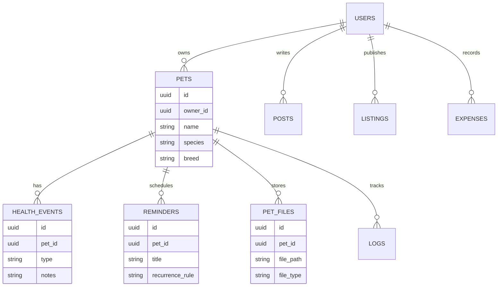

## 1.Architecture design


## 2.Technology Description
- Frontend: React@18 + TypeScript + vite + tailwindcss@3
- UI: design tokens (primary **celeste**) + componenti accessibili + stati standard (loading/empty/error)
- Motion: transizioni coerenti (150–200ms, ease-out) + rispetto `prefers-reduced-motion`
- Backend/Services: Firebase (Auth, Firestore, Storage)
- AI: Cloud Functions come **proxy** (API key solo server-side) + rate limit + logging minimo (userId, petId, timestamp)

## 3.Route definitions
| Route | Purpose |
|---|---|
| /onboarding | Tour guidato a step (primo accesso) |
| /login | Login / registrazione / recupero password |
| /app/dashboard | Dashboard semplificata + entry point IA |
| /app/pets/:petId | Scheda pet hub (salute/agenda/alimentazione/training/documenti) |
| /app/gps | Tracking, storico, geofence, alert |
| /app/explore | Community + marketplace + (opz.) moderazione |
| /app/expenses | Spese, budget, trend |
| /app/settings | Privacy/consensi, notifiche, export/cancellazione, preferenze IA |
| /share/:shareId | Condivisione cartella (read-only, link a scadenza) |

## 4.API definitions (If it includes backend services)
### 4.1 Cloud Function: AI contestuale (globale)
```
callable aiAssistant (Firebase Functions)
```
TypeScript (condivise)
```ts
type AiContext = {
  page: "dashboard"|"pet"|"gps"|"explore"|"expenses"|"settings";
  petId?: string;
  contextWindowDays?: number; // default 30
};

type AiAssistantRequest = {
  message: string;
  context: AiContext;
};

type AiAssistantResponse = {
  answer: string;
  actions?: { label: string; deepLink: string }[]; // es. apri promemoria, crea evento
  disclaimer: string; // sempre valorizzato
};
```

## 5.Server architecture diagram (If it includes backend services)


## 6.Data model(if applicable)
### 6.1 Data model definition

