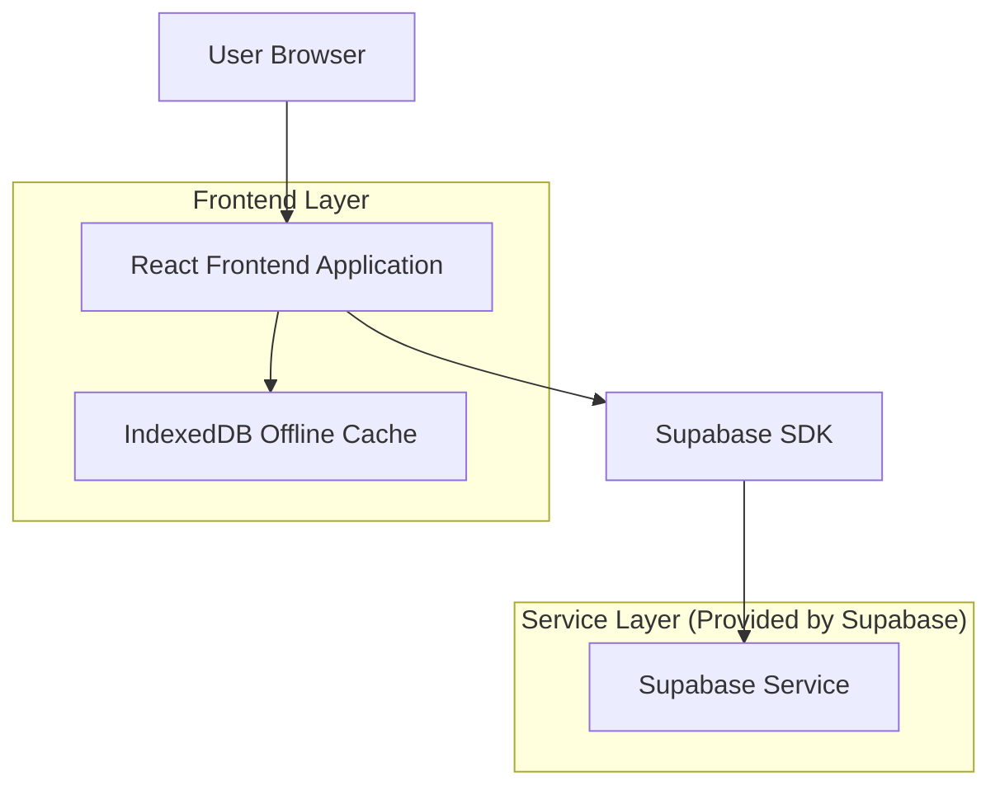
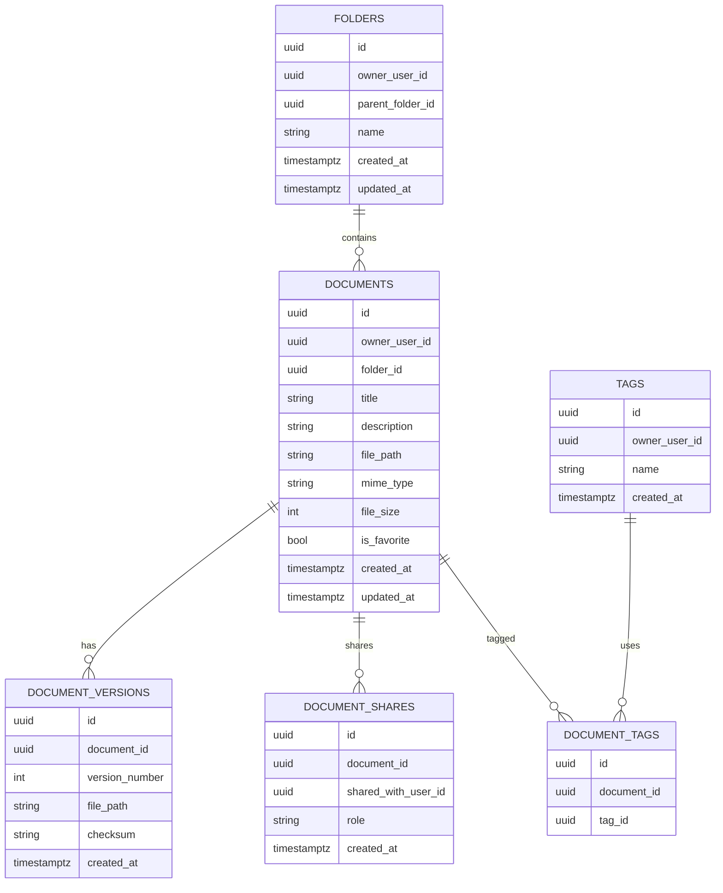

## 1.Architecture design


## 2.Technology Description
- Frontend: React@18 + vite + tailwindcss@3
- Backend: Supabase (Auth + PostgreSQL + Storage) via Supabase JS SDK
- Offline cache: IndexedDB (es. Dexie) per metadati e file selezionati

## 3.Route definitions
| Route | Purpose |
|-------|---------|
| /auth | Accesso: login/registrazione e recupero password |
| /docs | Dashboard: libreria documenti, ricerca/filtri, caricamento, offline/backup, condivisioni rapide |
| /docs/:id | Dettaglio documento: preview/download, metadati, versioni, permessi, offline |

## 6.Data model(if applicable)

### 6.1 Data model definition


### 6.2 Data Definition Language
Userà chiavi esterne logiche (senza vincoli FK fisici) per semplicità e portabilità.

Storage
- Bucket: `documents` (privato)
- Oggetti: `owner_user_id/document_id/version/file.ext`

DDL (PostgreSQL)
```sql
-- folders
CREATE TABLE folders (
  id UUID PRIMARY KEY DEFAULT gen_random_uuid(),
  owner_user_id UUID NOT NULL,
  parent_folder_id UUID NULL,
  name TEXT NOT NULL,
  created_at TIMESTAMPTZ NOT NULL DEFAULT NOW(),
  updated_at TIMESTAMPTZ NOT NULL DEFAULT NOW()
);
CREATE INDEX idx_folders_owner ON folders(owner_user_id);
CREATE INDEX idx_folders_parent ON folders(parent_folder_id);

-- tags
CREATE TABLE tags (
  id UUID PRIMARY KEY DEFAULT gen_random_uuid(),
  owner_user_id UUID NOT NULL,
  name TEXT NOT NULL,
  created_at TIMESTAMPTZ NOT NULL DEFAULT NOW()
);
CREATE UNIQUE INDEX ux_tags_owner_name ON tags(owner_user_id, name);

-- documents (metadati)
CREATE TABLE documents (
  id UUID PRIMARY KEY DEFAULT gen_random_uuid(),
  owner_user_id UUID NOT NULL,
  folder_id UUID NULL,
  title TEXT NOT NULL,
  description TEXT NULL,
  file_path TEXT NOT NULL,
  mime_type TEXT NOT NULL,
  file_size INTEGER NOT NULL,
  is_favorite BOOLEAN NOT NULL DEFAULT FALSE,
  created_at TIMESTAMPTZ NOT NULL DEFAULT NOW(),
  updated_at TIMESTAMPTZ NOT NULL DEFAULT NOW()
);
CREATE INDEX idx_documents_owner_updated ON documents(owner_user_id, updated_at DESC);
CREATE INDEX idx_documents_folder ON documents(folder_id);

-- versions
CREATE TABLE document_versions (
  id UUID PRIMARY KEY DEFAULT gen_random_uuid(),
  document_id UUID NOT NULL,
  version_number INTEGER NOT NULL,
  file_path TEXT NOT NULL,
  checksum TEXT NULL,
  created_at TIMESTAMPTZ NOT NULL DEFAULT NOW()
);
CREATE UNIQUE INDEX ux_document_versions_doc_ver ON document_versions(document_id, version_number);
CREATE INDEX idx_document_versions_doc ON document_versions(document_id);

-- shares
CREATE TABLE document_shares (
  id UUID PRIMARY KEY DEFAULT gen_random_uuid(),
  document_id UUID NOT NULL,
  shared_with_user_id UUID NOT NULL,
  role TEXT NOT NULL CHECK (role IN ('read','edit')),
  created_at TIMESTAMPTZ NOT NULL DEFAULT NOW()
);
CREATE UNIQUE INDEX ux_document_shares_doc_user ON document_shares(document_id, shared_with_user_id);
CREATE INDEX idx_document_shares_user ON document_shares(shared_with_user_id);

-- document_tags
CREATE TABLE document_tags (
  id UUID PRIMARY KEY DEFAULT gen_random_uuid(),
  document_id UUID NOT NULL,
  tag_id UUID NOT NULL
);
CREATE UNIQUE INDEX ux_document_tags_doc_tag ON document_tags(document_id, tag_id);
CREATE INDEX idx_document_tags_tag ON document_tags(tag_id);

-- Full-text search (titolo + descrizione)
ALTER TABLE documents ADD COLUMN search_tsv tsvector
  GENERATED ALWAYS AS (to_tsvector('simple', coalesce(title,'') || ' ' || coalesce(description,''))) STORED;
CREATE INDEX idx_documents_search_tsv ON documents USING GIN (search_tsv);

-- Grants (guideline Supabase)
GRANT SELECT ON folders, tags, documents, document_versions, document_shares, document_tags TO anon;
GRANT ALL PRIVILEGES ON folders, tags, documents, document_versions, document_shares, document_tags TO authenticated;
```

RLS (linee guida operative)
- Abilitare RLS su tutte le tabelle.
- Policy di lettura: owner o utente in `document_shares`.
- Policy di scrittura: owner; per chi è in share con ruolo `edit` consentire update metadati e inserimento versioni (non cambio owner).

Offline/Backup (logica)
- Offline: salvare in IndexedDB metadati + file blob dei documenti marcati “offline”; sincronizzare al ritorno online.
- Backup: generare lato client un export zip (manifest JSON + file) scaricando da Storage i documenti selezionati.
