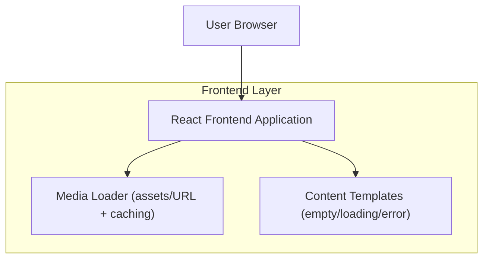

## 1.Architecture design

## 2.Technology Description
- Frontend: React@18 + TypeScript + vite + tailwindcss@3
- Backend: None (per questa richiesta; contenuti e media gestiti client-side)

## 3.Route definitions
| Route | Purpose |
|-------|---------|
| / | Home/Dashboard con card e anteprime immagini reali |
| /gallery (o sezione equivalente) | Galleria immagini con griglia e lazy-load |
| /:feature (pagine esistenti) | Pagine che adottano un template “contenuto completo” per evitare schermi bianchi |

## 6.Data model(if applicable)
Non è richiesto un nuovo database per ottenere immagini visibili e contenuti non-vuoti.

**Opzione (solo se serve in seguito):** memorizzare metadati immagini e contenuti in un datastore (es. Supabase Postgres + Storage) per aggiornamenti dinamici senza release.
