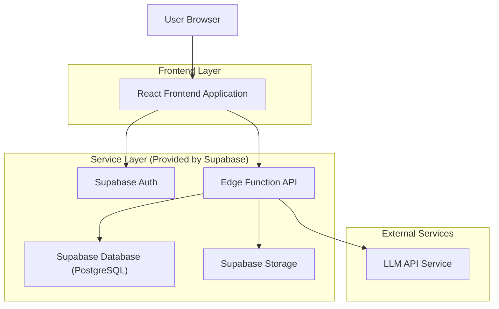
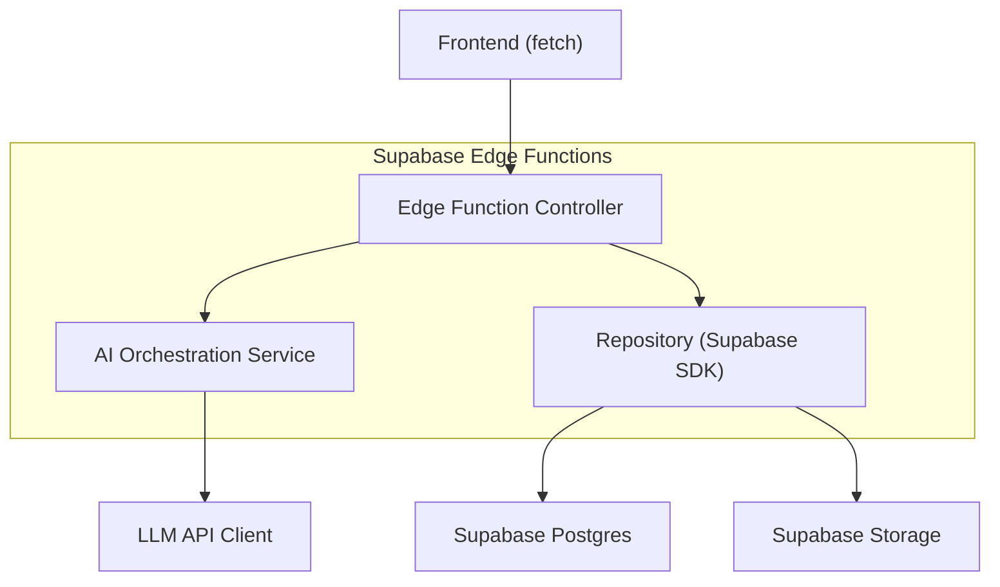
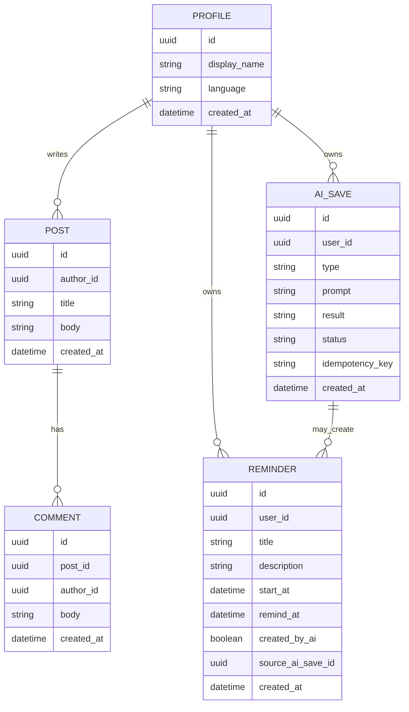

## 1.Architecture design


## 2.Technology Description
- Frontend: React@18 + vite + TypeScript + tailwindcss@3 + react-router + i18next
- Backend: Supabase (Auth, Postgres, Storage, Edge Functions)
- External Services: LLM API (per generare promemoria e contenuti AI; chiave API custodita in Edge Function secrets)

## 3.Route definitions
| Route | Purpose |
|-------|---------|
| /login | Accesso/registrazione e ripristino sessione |
| / | Home (panoramica community + agenda) |
| /community | Feed community e creazione post |
| /community/:postId | Dettaglio post e commenti |
| /agenda | Calendario e promemoria (manuali o da AI) |
| /ai-saves | Elenco e dettaglio salvataggi AI |
| /settings | Impostazioni, cambio lingua |

## 4.API definitions (If it includes backend services)
### 4.1 Edge Functions (core)
1) Generazione promemoria da AI
```
POST /functions/v1/ai-generate-reminder
```
Request
| Param Name | Param Type | isRequired | Description |
|---|---|---|---|
| inputText | string | true | Testo libero (es. “ricordami di…”) |
| timezone | string | true | Timezone utente (es. Europe/Rome) |
| idempotencyKey | string | true | Evita duplicati su retry |

Response
| Param Name | Param Type | Description |
|---|---|---|
| saveId | string | ID del salvataggio AI |
| proposedReminder | object | Campi promemoria proposti (titolo, datetime, note) |
| status | 'succeeded'|'failed' | Esito generazione |

2) Salvataggio affidabile output AI (atomico)
```
POST /functions/v1/ai-save
```
Request
| Param Name | Param Type | isRequired | Description |
|---|---|---|---|
| type | 'reminder_suggestion'|'generic' | true | Tipo di salvataggio |
| prompt | string | true | Prompt/testo di input |
| result | string | true | Output AI da archiviare |
| idempotencyKey | string | true | Evita duplicati |

Response
| Param Name | Param Type | Description |
|---|---|---|
| saveId | string | ID record creato/ritornato |
| status | 'succeeded'|'failed' | Esito salvataggio |

### 4.2 Shared TypeScript types (semplificati)
```ts
export type LanguageCode = 'it' | 'en' | 'es' | 'fr' | string;

export type Post = {
  id: string;
  authorId: string;
  title: string;
  body: string;
  createdAt: string;
};

export type Comment = {
  id: string;
  postId: string;
  authorId: string;
  body: string;
  createdAt: string;
};

export type Reminder = {
  id: string;
  userId: string;
  title: string;
  description?: string;
  startAt: string; // ISO
  remindAt?: string; // ISO
  createdByAi: boolean;
  sourceAiSaveId?: string;
};

export type AiSaveStatus = 'succeeded' | 'failed';
export type AiSave = {
  id: string;
  userId: string;
  type: 'reminder_suggestion' | 'generic';
  prompt: string;
  result: string;
  status: AiSaveStatus;
  idempotencyKey: string;
  createdAt: string;
};
```

## 5.Server architecture diagram (If it includes backend services)


## 6.Data model(if applicable)
### 6.1 Data model definition


### 6.2 Data Definition Language
```sql
-- profiles (1:1 con auth.users a livello applicativo, senza FK fisica)
CREATE TABLE profiles (
  id UUID PRIMARY KEY,
  display_name TEXT,
  language TEXT NOT NULL DEFAULT 'it',
  created_at TIMESTAMPTZ NOT NULL DEFAULT NOW()
);

CREATE TABLE posts (
  id UUID PRIMARY KEY DEFAULT gen_random_uuid(),
  author_id UUID NOT NULL,
  title TEXT NOT NULL,
  body TEXT NOT NULL,
  created_at TIMESTAMPTZ NOT NULL DEFAULT NOW()
);
CREATE INDEX idx_posts_created_at ON posts (created_at DESC);

CREATE TABLE comments (
  id UUID PRIMARY KEY DEFAULT gen_random_uuid(),
  post_id UUID NOT NULL,
  author_id UUID NOT NULL,
  body TEXT NOT NULL,
  created_at TIMESTAMPTZ NOT NULL DEFAULT NOW()
);
CREATE INDEX idx_comments_post_id_created_at ON comments (post_id, created_at ASC);

CREATE TABLE reminders (
  id UUID PRIMARY KEY DEFAULT gen_random_uuid(),
  user_id UUID NOT NULL,
  title TEXT NOT NULL,
  description TEXT,
  start_at TIMESTAMPTZ NOT NULL,
  remind_at TIMESTAMPTZ,
  created_by_ai BOOLEAN NOT NULL DEFAULT FALSE,
  source_ai_save_id UUID,
  created_at TIMESTAMPTZ NOT NULL DEFAULT NOW()
);
CREATE INDEX idx_reminders_user_id_start_at ON reminders (user_id, start_at ASC);

CREATE TABLE ai_saves (
  id UUID PRIMARY KEY DEFAULT gen_random_uuid(),
  user_id UUID NOT NULL,
  type TEXT NOT NULL,
  prompt TEXT NOT NULL,
  result TEXT NOT NULL,
  status TEXT NOT NULL CHECK (status IN ('succeeded','failed')),
  idempotency_key TEXT NOT NULL,
  created_at TIMESTAMPTZ NOT NULL DEFAULT NOW(),
  UNIQUE (user_id, idempotency_key)
);
CREATE INDEX idx_ai_saves_user_id_created_at ON ai_saves (user_id, created_at DESC);

-- Grants (guideline)
GRANT SELECT ON profiles, posts, comments TO anon;
GRANT ALL PRIVILEGES ON profiles, posts, comments, reminders, ai_saves TO authenticated;
```

