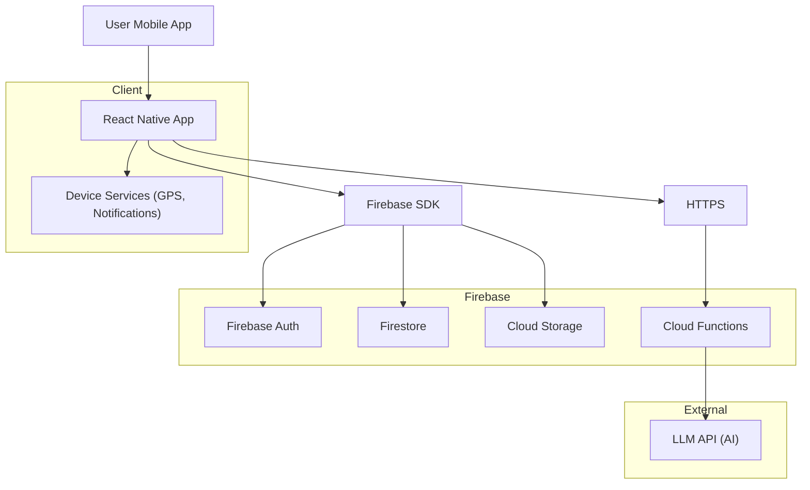
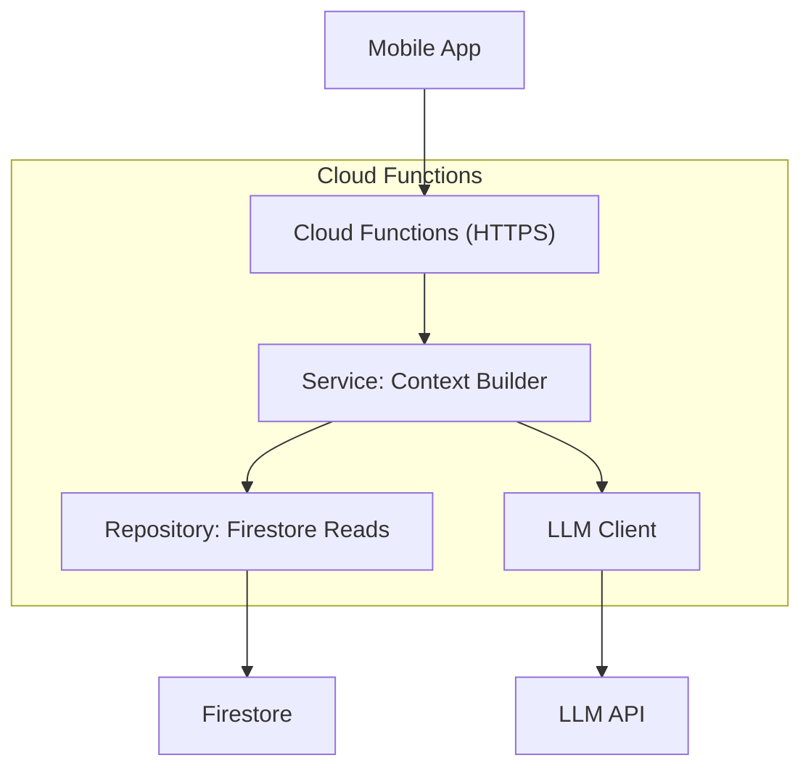
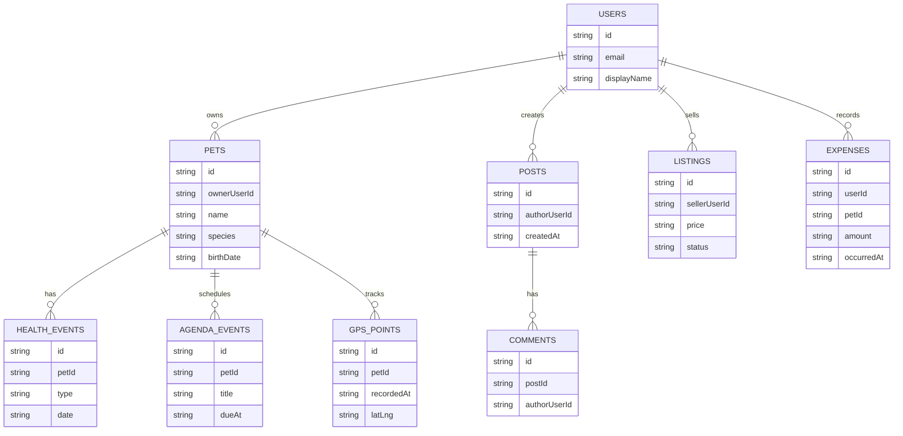

## 1.Architecture design


## 2.Technology Description
- Frontend (mobile): React Native@0.7x + Expo + TypeScript
- Backend: Firebase (Auth, Firestore, Cloud Storage, Cloud Functions)
- AI: Cloud Functions come proxy sicuro verso provider LLM (API key solo server-side)

## 3.Route definitions
| Route (Screen) | Purpose |
|---|---|
| /auth/login | Login e accesso account |
| /auth/register | Registrazione |
| /home | Dashboard multi-animale |
| /pets | Elenco animali |
| /pets/:petId | Profilo animale |
| /health/:petId | Salute + longevità |
| /agenda | Calendario e promemoria |
| /gps/:petId | Mappa, tracking, aree sicure |
| /community | Feed e interazioni |
| /marketplace | Annunci e pubblicazione |
| /expenses | Spese e budget |
| /ai/:petId | Assistente AI |
| /settings | Impostazioni account/privacy |

## 4.API definitions (If it includes backend services)
### 4.1 Cloud Functions (HTTPS)
Generazione AI (chat/riassunti)
```
POST /aiChat
```
Request (TypeScript)
```ts
type AiChatRequest = {
  userId: string;
  petId?: string;
  message: string;
  contextWindowDays?: number; // es. 30
};

type AiChatResponse = {
  answer: string;
  sources?: string[]; // es. "healthEvents", "expenses"
};
```

## 5.Server architecture diagram (If it includes backend services)


## 6.Data model(if applicable)
### 6.1 Data model definition
Concetto logico (Firestore = collections/documents).


### 6.2 Data Definition Language
Non applicabile (Firestore non usa DDL SQL). Struttura consigliata:
- users/{userId}
- pets/{petId} (ownerUserId)
- healthEvents/{eventId} (petId)
- agendaEvents/{eventId} (petId)
- gpsPoints/{pointId} (petId)
- posts/{postId}, comments/{commentId}
- listings/{listingId}
- expenses/{expenseId} (userId, petId)

Permessi (security rules): lettura/scrittura consentita solo a documenti con ownerUserId/userId uguale all’utente autenticato; contenuti community/marketplace con regole dedicate (pubblici in lettura, scrittura autenticata, moderazione via claim/ruolo).