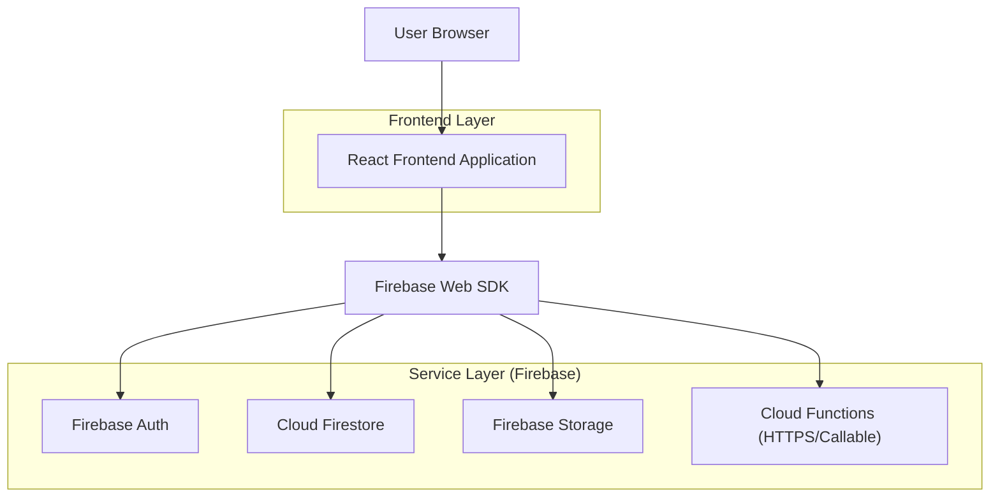
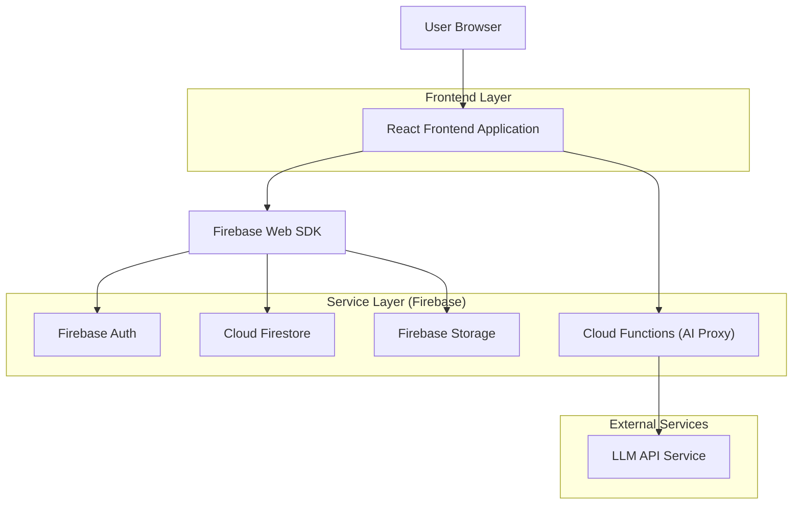
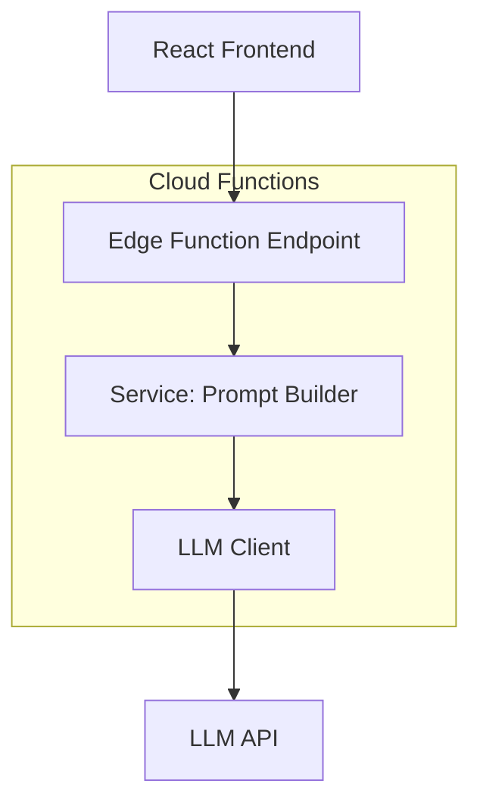
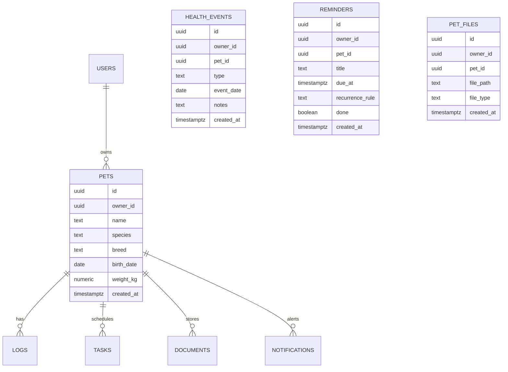

## 1.Architecture design

### MVP (senza AI)


### Fase 2 (Assistente AI informativo)
Nota: la Function funge da **proxy** (API key server-side) e può includere rate-limit e logging minimo.


## 2.Technology Description
- Frontend: React@18 + TypeScript + vite + tailwindcss@3
- Backend/Services: Firebase (Auth, Firestore, Storage, Cloud Functions)
- AI (Fase 2): Cloud Functions come proxy verso provider LLM (API key **solo server-side**)

## 3.Route definitions
| Route | Purpose |
|-------|---------|
| /login | Login / registrazione / recupero password |
| /app/dashboard | Selettore multi-animale e panoramica |
| /app/pets | Scheda animale avanzata (anagrafica, salute, documenti, contatti vet) |
| /app/records | Cartella clinica + condivisione |
| /app/agenda | Agenda + export ICS |
| /app/expenses | Spese + ricorrenti |
| /app/community | Feed + gruppi |
| /app/moderation | Moderazione (solo moderatori) |
| /app/settings | Preferenze/AI/privacy |

## 4.API definitions (If it includes backend services)
L’MVP usa Firebase SDK direttamente per Auth/DB/Storage. Le Cloud Functions esistono per:
- Billing (Stripe)
- AI proxy
- Sweep schedulati (promemoria, indici salute, retention, ecc.)
- Link condivisi allegati (URL firmati)

### 4.1 (Fase 2) Cloud Function: AI informativa
```
callable aiChat (Firebase Functions)
```
TypeScript (condivise)
```ts
type AiChatRequest = {
  petId: string;
  message: string;
  contextWindowDays?: number; // default 30
};

type AiChatResponse = {
  answer: string;
  disclaimer: string; // sempre valorizzato
};
```
Note funzionali:
- La funzione **non** fornisce diagnosi o indicazioni terapeutiche; restituisce solo informazioni generali + disclaimer.
- La funzione agisce da **proxy** verso LLM (API key server-side); il contesto può essere passato dal client.
- Opzionale: log minimale (userId, petId, timestamp) per audit/abuso.

## 5.Server architecture diagram (If it includes backend services)
(Fase 2)


## 6.Data model(if applicable)

### 6.1 Data model definition


### 6.2 Note modello dati
I dati sono in Cloud Firestore con collezioni principali:
- `pets/{petId}`
- `pets/{petId}/logs` (food/water/activity/weight/symptom/vet)
- `pets/{petId}/tasks` (promemoria/routine)
- `pets/{petId}/documents`
- `pets/{petId}/notifications`
- `recordShares/{shareId}` (condivisione cartella clinica)
- `posts/{postId}` + `posts/{postId}/comments` (community)
- `groups/{groupId}` + `groups/{groupId}/messages` (community chat)

Le regole Firestore isolano i dati per proprietario e gestiscono moderazione via `moderators/{uid}` e `bans/{uid}`.
