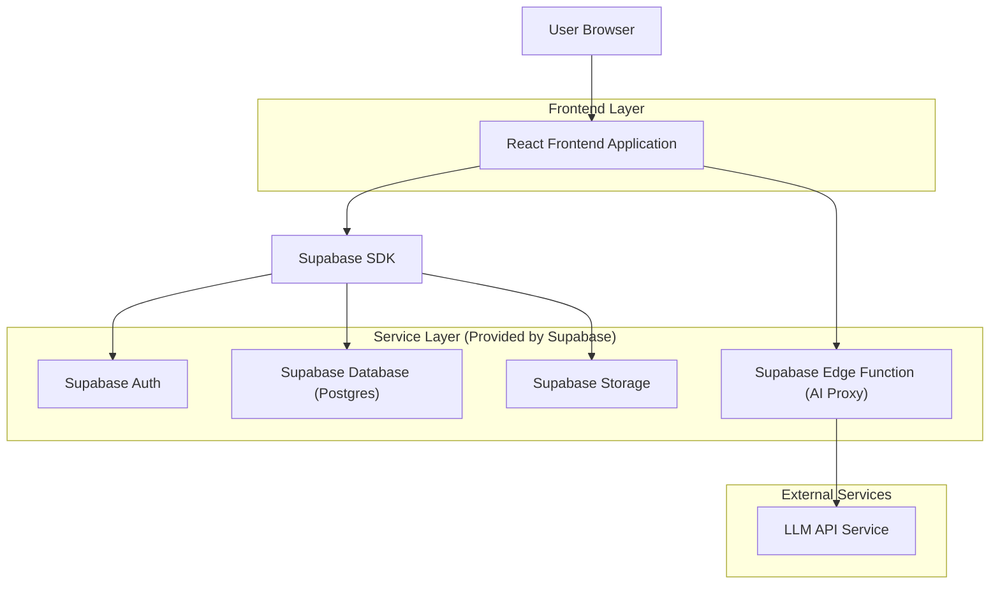
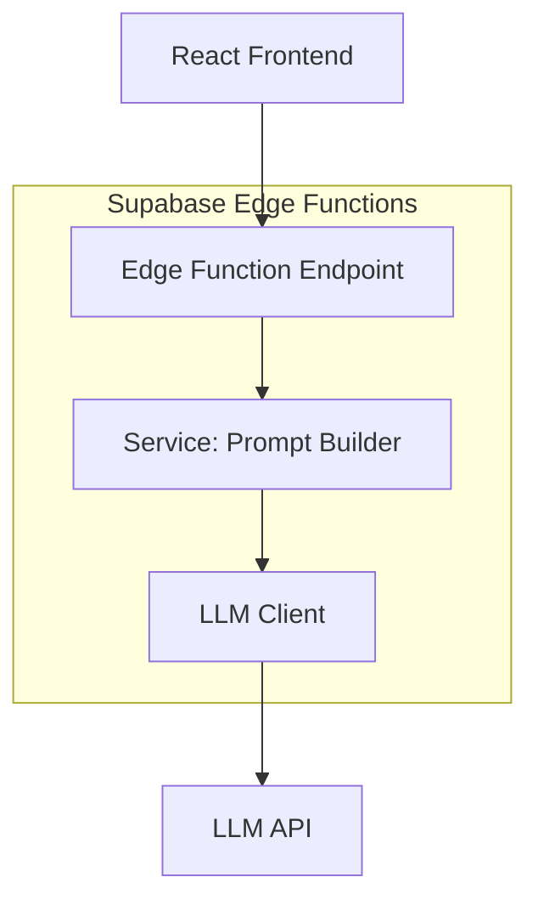
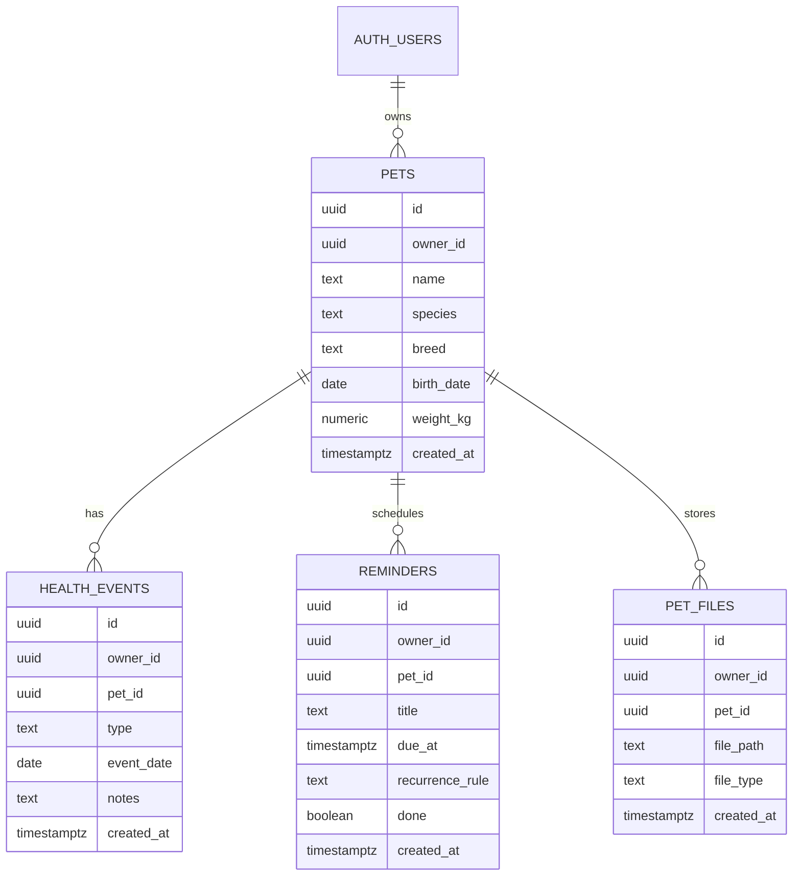

## 1.Architecture design


## 2.Technology Description
- Frontend: React@18 + TypeScript + vite + tailwindcss@3
- Backend: Supabase (Auth, Postgres, Storage, Edge Functions)
- AI: Edge Function come proxy verso provider LLM (API key **solo server-side**)

## 3.Route definitions
| Route | Purpose |
|-------|---------|
| /login | Login / registrazione / recupero password |
| /dashboard | Selettore multi-animale e panoramica promemoria/eventi |
| /pets/:petId | Scheda animale (anagrafica, salute, promemoria, documenti) |
| /ai | Assistente AI informativo (con disclaimer) |
| /settings | Privacy, export e cancellazione dati |

## 4.API definitions (If it includes backend services)
### 4.1 Edge Function: AI informativa
```
POST /functions/v1/ai-chat
```
TypeScript (condivise)
```ts
type AiChatRequest = {
  petId: string;
  message: string;
  contextWindowDays?: number; // default 30
};

type AiChatResponse = {
  answer: string;
  disclaimer: string; // sempre valorizzato
};
```
Note funzionali:
- La funzione **non** fornisce diagnosi o indicazioni terapeutiche; restituisce solo informazioni generali + disclaimer.
- Opzionale: log minimale (userId, petId, timestamp) per audit/abuso.

## 5.Server architecture diagram (If it includes backend services)


## 6.Data model(if applicable)

### 6.1 Data model definition


### 6.2 Data Definition Language
Tabelle applicative (senza vincoli FK fisici; FK logiche via campi `owner_id`, `pet_id`).
```sql
CREATE TABLE pets (
  id uuid PRIMARY KEY DEFAULT gen_random_uuid(),
  owner_id uuid NOT NULL,
  name text NOT NULL,
  species text NOT NULL,
  breed text,
  birth_date date,
  weight_kg numeric,
  created_at timestamptz NOT NULL DEFAULT now()
);

CREATE TABLE health_events (
  id uuid PRIMARY KEY DEFAULT gen_random_uuid(),
  owner_id uuid NOT NULL,
  pet_id uuid NOT NULL,
  type text NOT NULL,
  event_date date NOT NULL,
  notes text,
  created_at timestamptz NOT NULL DEFAULT now()
);

CREATE TABLE reminders (
  id uuid PRIMARY KEY DEFAULT gen_random_uuid(),
  owner_id uuid NOT NULL,
  pet_id uuid NOT NULL,
  title text NOT NULL,
  due_at timestamptz NOT NULL,
  recurrence_rule text,
  done boolean NOT NULL DEFAULT false,
  created_at timestamptz NOT NULL DEFAULT now()
);

CREATE TABLE pet_files (
  id uuid PRIMARY KEY DEFAULT gen_random_uuid(),
  owner_id uuid NOT NULL,
  pet_id uuid NOT NULL,
  file_path text NOT NULL,
  file_type text,
  created_at timestamptz NOT NULL DEFAULT now()
);

-- Abilitare RLS
ALTER TABLE pets ENABLE ROW LEVEL SECURITY;
ALTER TABLE health_events ENABLE ROW LEVEL SECURITY;
ALTER TABLE reminders ENABLE ROW LEVEL SECURITY;
ALTER TABLE pet_files ENABLE ROW LEVEL SECURITY;

-- Policy: accesso solo al proprietario
CREATE POLICY pets_owner_rw ON pets
  FOR ALL TO authenticated
  USING (owner_id = auth.uid())
  WITH CHECK (owner_id = auth.uid());

CREATE POLICY health_events_owner_rw ON health_events
  FOR ALL TO authenticated
  USING (owner_id = auth.uid())
  WITH CHECK (owner_id = auth.uid());

CREATE POLICY reminders_owner_rw ON reminders
  FOR ALL TO authenticated
  USING (owner_id = auth.uid())
  WITH CHECK (owner_id = auth.uid());

CREATE POLICY pet_files_owner_rw ON pet_files
  FOR ALL TO authenticated
  USING (owner_id = auth.uid())
  WITH CHECK (owner_id = auth.uid());

-- Privilegi (pattern Supabase)
GRANT ALL PRIVILEGES ON pets, health_events, reminders, pet_files TO authenticated;
```
