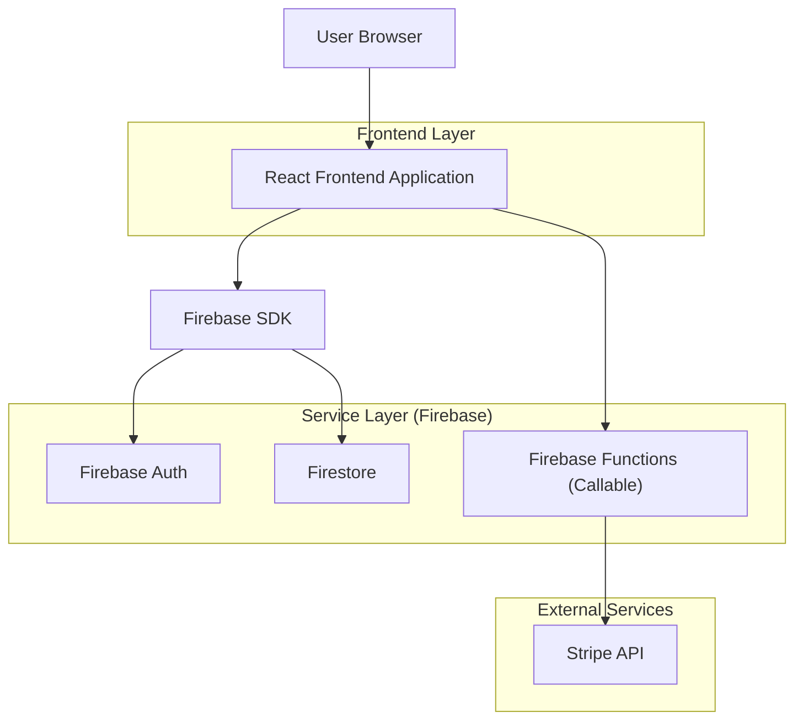
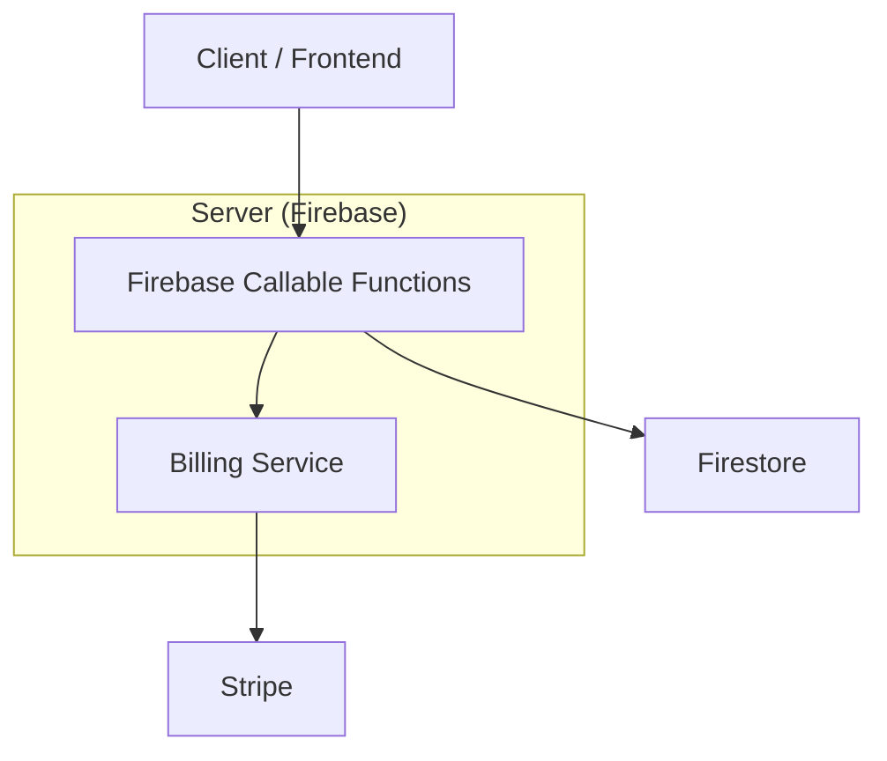
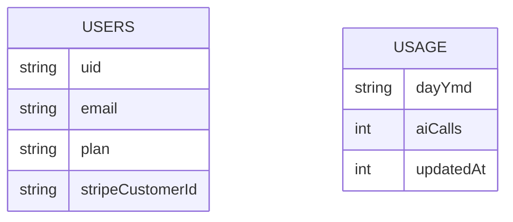

## 1.Architecture design


## 2.Technology Description
- Frontend: React@18 + react-router-dom@7 + tailwindcss@3 + vite
- Backend: Firebase (Auth + Firestore + Cloud Functions)
- Payments: Stripe (via Cloud Functions)

## 3.Route definitions
| Route | Purpose |
|---|---|
| / | Landing/entry (redirect o contenuti pubblici) |
| /login | Login |
| /onboarding | Setup iniziale |
| /app/dashboard | Home app + IA (Core/Secondaria/Farm) |
| /app/ai/* | AI hub (chat/symptoms/photo/video/summary/saves) |
| /app/farm/* | Area Farm (shell dedicata) |
| /app/settings | Impostazioni + sezione Piano/Checkout callback |

## 4.API definitions (If it includes backend services)
### 4.1 Core API
Billing / Premium (Firebase callable)
```
billingStatus()
billingCreateCheckoutSession()
billingCreatePortalSession()
```
Type condivisi (frontend)
```ts
type BillingStatus = {
  billingEnabled: boolean;
  betaProEnabled: boolean;
  betaProUntilMs: number | null;
  plan: "free" | "pro";
  effectivePlan: "free" | "pro";
};
```

## 5.Server architecture diagram (If it includes backend services)


## 6.Data model(if applicable)
### 6.1 Data model definition
Entità minime per Premium:


## 7.Modifiche concrete (repo)
- IA Nav: refactor in `src/components/AppShellLayout.tsx` per separare **Core**, **Secondaria**, **Farm** (3 gruppi top-level), riducendo voci non-core in sidebar principale.
- Stato piano: aggiungere store/hook (es. `src/stores/billingStore.ts`) che usa `src/data/billing.ts#getBillingStatus` e cachea `BillingStatus`.
- Paywall: creare componente riusabile (es. `src/components/billing/PremiumGateModal.tsx`) + helper `useRequirePro()`.
- Entry Premium: aggiungere item “Premium” (o sezione in Settings) con CTA `billingCreateCheckoutSession()` e “Gestisci abbonamento” `billingCreatePortalSession()`.
- Badge/lock: in nav e card UI, mostrare lucchetto e tooltip + deep link a Premium.
- Test: aggiungere Playwright e2e per (1) click feature Pro → paywall (2) ritorno success (mock) → UI Pro.
