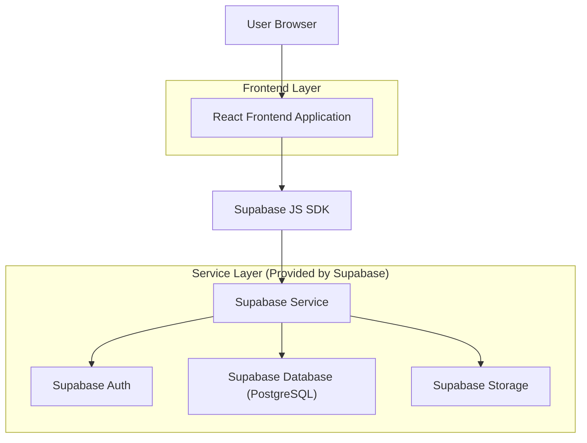
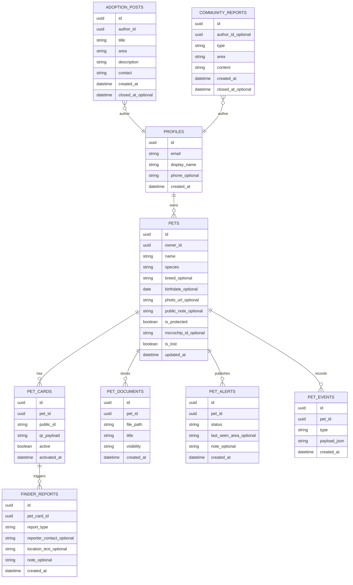

## 1.Architecture design


## 2.Technology Description
- Frontend: React@18 + vite + tailwindcss@3
- Backend: Supabase (Auth, PostgreSQL, Storage)

## 3.Route definitions
| Route | Purpose |
|-------|---------|
| / | Landing con Hero, CTA “Attiva protezione”, accessi rapidi |
| /auth | Login/registrazione proprietario |
| /attiva | Wizard “Attiva protezione” e associazione QR/ID |
| /owner | Area Proprietario (pet, documenti, segnalazioni) |
| /p/:publicId | Profilo pet pubblico da QR/ID |
| /community | Feed Segnalazioni + Bacheca Adozioni + Anti-abbandono |

## 4.Core flows

### 4.1 Flusso scansione QR/ID → scheda pubblica
1. Il QR contiene un payload del tipo `https://<domain>/p/<publicId>`.
2. La pagina pubblica carica i dati pubblici del pet associato a `publicId`.
3. La pagina mostra:
   - badge “Pet Protetto PetLyon”
   - stato “Smarrito” se attivo
   - azioni “Ho trovato” / “Ho avvistato”
4. L’invio segnalazione crea un record `finder_reports` e (opzionale) un evento in `pet_events`.

### 4.2 Flusso “Attiva protezione” (proprietario)
1. Login/registrazione.
2. Creazione profilo pet.
3. Associazione `publicId` (QR/ID) a quel pet.
4. Attivazione stato “Protetto” e generazione/visualizzazione QR.

## 6.Data model(if applicable)

### 6.1 Data model definition


### 6.2 Data Definition Language
User profiles (profiles)
```sql
CREATE TABLE profiles (
  id UUID PRIMARY KEY,
  email TEXT NOT NULL,
  display_name TEXT,
  phone_optional TEXT,
  created_at TIMESTAMPTZ DEFAULT now()
);
```

Pets (pets)
```sql
CREATE TABLE pets (
  id UUID PRIMARY KEY DEFAULT gen_random_uuid(),
  owner_id UUID NOT NULL,
  name TEXT NOT NULL,
  species TEXT NOT NULL,
  breed_optional TEXT,
  birthdate_optional DATE,
  photo_url_optional TEXT,
  public_note_optional TEXT,
  is_protected BOOLEAN DEFAULT false,
  microchip_id_optional TEXT,
  is_lost BOOLEAN DEFAULT false,
  updated_at TIMESTAMPTZ DEFAULT now()
);
CREATE INDEX idx_pets_owner_id ON pets(owner_id);
```

QR/ID cards (pet_cards)
```sql
CREATE TABLE pet_cards (
  id UUID PRIMARY KEY DEFAULT gen_random_uuid(),
  pet_id UUID NOT NULL,
  public_id TEXT UNIQUE NOT NULL,
  qr_payload TEXT NOT NULL,
  active BOOLEAN DEFAULT true,
  activated_at TIMESTAMPTZ DEFAULT now()
);
CREATE INDEX idx_pet_cards_pet_id ON pet_cards(pet_id);
```

Finder reports (finder_reports)
```sql
CREATE TABLE finder_reports (
  id UUID PRIMARY KEY DEFAULT gen_random_uuid(),
  pet_card_id UUID NOT NULL,
  report_type TEXT NOT NULL CHECK (report_type IN ('found','sighted')),
  reporter_contact_optional TEXT,
  location_text_optional TEXT,
  note_optional TEXT,
  created_at TIMESTAMPTZ DEFAULT now()
);
CREATE INDEX idx_finder_reports_pet_card_id ON finder_reports(pet_card_id);
```

Pet events (pet_events)
```sql
CREATE TABLE pet_events (
  id UUID PRIMARY KEY DEFAULT gen_random_uuid(),
  pet_id UUID NOT NULL,
  type TEXT NOT NULL,
  payload_json JSONB NOT NULL DEFAULT '{}'::jsonb,
  created_at TIMESTAMPTZ DEFAULT now()
);
CREATE INDEX idx_pet_events_pet_id ON pet_events(pet_id);
```

Pet documents (pet_documents)
```sql
CREATE TABLE pet_documents (
  id UUID PRIMARY KEY DEFAULT gen_random_uuid(),
  pet_id UUID NOT NULL,
  file_path TEXT NOT NULL,
  title TEXT NOT NULL,
  visibility TEXT NOT NULL CHECK (visibility IN ('private','link')),
  created_at TIMESTAMPTZ DEFAULT now()
);
CREATE INDEX idx_pet_documents_pet_id ON pet_documents(pet_id);
```

Community & adoptions
```sql
CREATE TABLE community_reports (
  id UUID PRIMARY KEY DEFAULT gen_random_uuid(),
  author_id_optional UUID,
  type TEXT NOT NULL CHECK (type IN ('sighting','found','abandonment')),
  area TEXT NOT NULL,
  content TEXT NOT NULL,
  created_at TIMESTAMPTZ DEFAULT now(),
  closed_at_optional TIMESTAMPTZ
);

CREATE TABLE adoption_posts (
  id UUID PRIMARY KEY DEFAULT gen_random_uuid(),
  author_id UUID NOT NULL,
  title TEXT NOT NULL,
  area TEXT NOT NULL,
  description TEXT NOT NULL,
  contact TEXT NOT NULL,
  created_at TIMESTAMPTZ DEFAULT now(),
  closed_at_optional TIMESTAMPTZ
);
```

Permission baseline (da rifinire con RLS per record-level access)
```sql
GRANT SELECT ON pets, pet_cards TO anon;
GRANT INSERT ON finder_reports, community_reports TO anon;

GRANT ALL PRIVILEGES ON profiles, pets, pet_cards, finder_reports, pet_documents, community_reports, adoption_posts TO authenticated;

GRANT SELECT ON pet_events TO anon;
GRANT ALL PRIVILEGES ON pet_events TO authenticated;
```

Storage buckets (logica)
- Bucket: pet-photos (read: anon su file pubblici; write: authenticated)
- Bucket: pet-documents (read: solo owner; write: solo owner; link sharing gestito via "visibility='link'" e URL firmate lato client)
