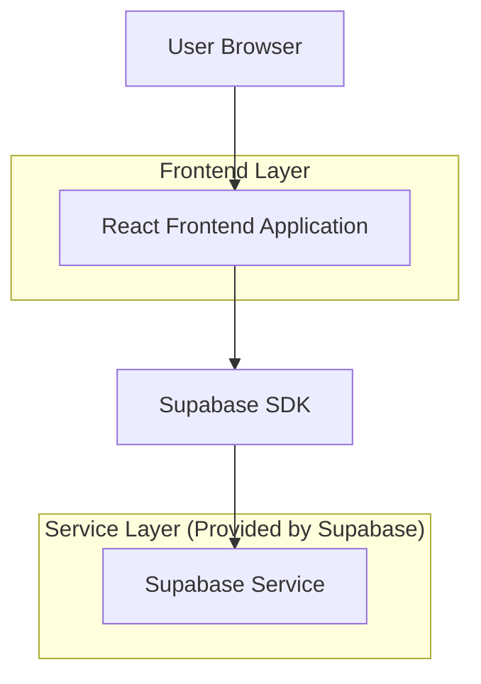
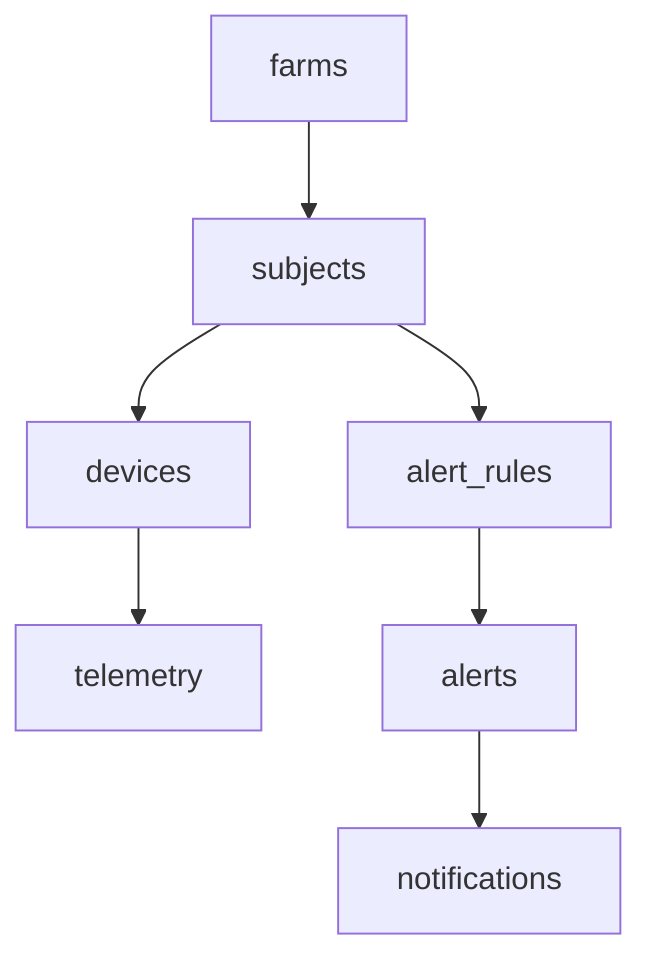

## 1.Architecture design


Nota: per la mock demo end‑to‑end, il motore alert gira nel frontend (event-driven). In produzione può essere spostato su Supabase Edge Functions/cron senza cambiare il modello dati.

## 2.Technology Description
- Frontend: React@18 + TypeScript + vite + tailwindcss@3
- Backend: Supabase (PostgreSQL + Realtime)

## 3.Route definitions
| Route | Purpose |
|-------|---------|
| /dashboard | Dashboard unica con switch Pet/Farm, KPI e feed alert/notifiche |
| /devices | Registro device, selezione DeviceAdapter, mapping verso modello unificato, demo simulator |
| /alerts | Regole, lista alert, storico, inbox notifiche |

## 6.Data model(if applicable)

### 6.1 Data model definition


Entità chiave (modello unificato):
- `subjects`: rappresenta sia pet sia bovini (`subject_type`), con campi comuni.
- `devices`: device fisici o virtuali (demo) associati a un subject.
- `telemetry`: misurazioni normalizzate (JSON) + timestamp.
- `alert_rules`: regole minime (threshold + finestra + severità) per subject/specie.
- `alerts`: istanze generate dal motore alert.
- `notifications`: notifiche in‑app generate da alert.
- `farms`: contenitore logico per soggetti bovini (opzionale per pet).

### 6.2 Data Definition Language
```sql
-- farms
create table farms (
  id uuid primary key default gen_random_uuid(),
  name text not null,
  created_at timestamptz default now()
);

-- subjects (pet + bovini)
create table subjects (
  id uuid primary key default gen_random_uuid(),
  subject_type text not null check (subject_type in ('pet','bovine')),
  display_name text not null,
  species text null,
  farm_id uuid null,
  created_at timestamptz default now()
);

-- devices
create table devices (
  id uuid primary key default gen_random_uuid(),
  subject_id uuid not null,
  adapter_type text not null,
  external_device_id text null,
  status text not null default 'offline' check (status in ('online','offline')),
  adapter_config jsonb not null default '{}'::jsonb,
  last_seen_at timestamptz null,
  created_at timestamptz default now()
);

-- telemetry (normalizzata)
create table telemetry (
  id uuid primary key default gen_random_uuid(),
  device_id uuid not null,
  subject_id uuid not null,
  ts timestamptz not null,
  metrics jsonb not null,
  raw_payload jsonb null
);

-- alert rules
create table alert_rules (
  id uuid primary key default gen_random_uuid(),
  scope text not null check (scope in ('subject','type')),
  subject_id uuid null,
  subject_type text null,
  metric_key text not null,
  operator text not null check (operator in ('>','>=','<','<=','==')),
  threshold numeric not null,
  window_minutes int not null default 10,
  severity text not null check (severity in ('info','warning','critical')),
  enabled boolean not null default true,
  created_at timestamptz default now()
);

-- alerts + notifications
create table alerts (
  id uuid primary key default gen_random_uuid(),
  rule_id uuid not null,
  subject_id uuid not null,
  device_id uuid not null,
  opened_at timestamptz not null default now(),
  closed_at timestamptz null,
  status text not null default 'open' check (status in ('open','closed')),
  details jsonb not null default '{}'::jsonb
);

create table notifications (
  id uuid primary key default gen_random_uuid(),
  alert_id uuid not null,
  created_at timestamptz not null default now(),
  channel text not null default 'in_app' check (channel in ('in_app')),
  title text not null,
  body text not null,
  read_at timestamptz null
);

-- permissions (indicative)
grant select on farms, subjects, devices, telemetry, alert_rules, alerts, notifications to anon;
grant all privileges on farms, subjects, devices, telemetry, alert_rules, alerts, notifications to authenticated;
```
