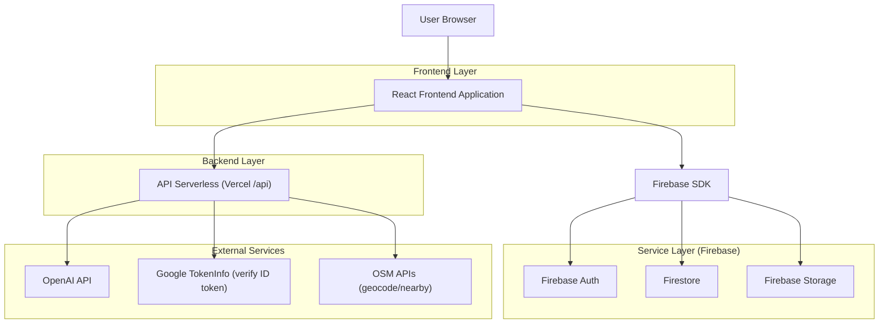
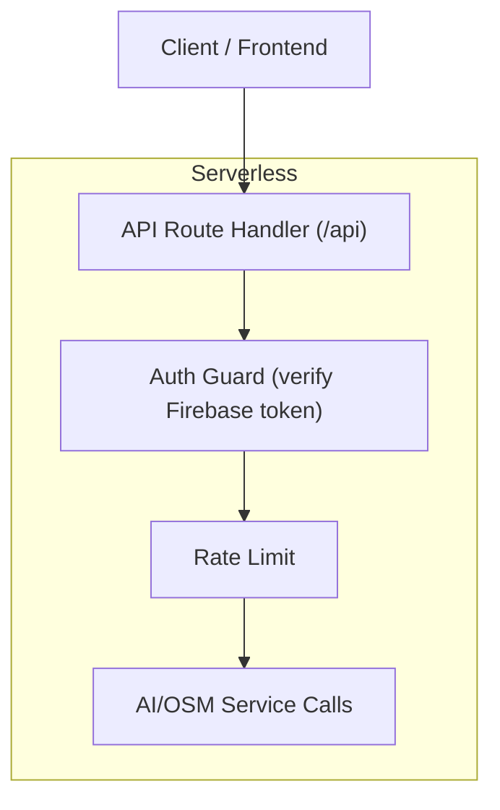
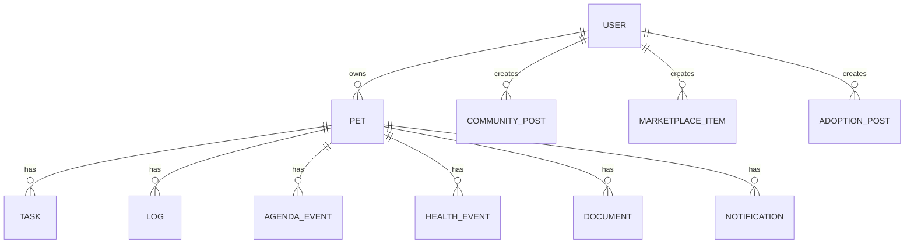

## 1.Architecture design


## 2.Technology Description
- Frontend: React@18 + react-router-dom@7 + tailwindcss@3 + vite
- State: zustand@5
- Mappe: leaflet@1 + react-leaflet@4
- Backend (necessario per chiavi e sicurezza): Vercel Serverless Functions (cartella /api) + OpenAI SDK
- Backend secondario: Firebase Cloud Functions (cartella /functions) per estensioni future

## 3.Route definitions
| Route | Purpose |
|---|---|
| / | Home (marketing + CTA) |
| /login | Login / Signup / Reset / Demo |
| /onboarding | Setup iniziale (solo autenticati) |
| /share/:token | Visualizzazione record condivisi |
| /app/dashboard | Dashboard |
| /app/explore | Esplora (hub) |
| /app/pets | Profilo Pet |
| /app/status | Status |
| /app/notifications | Notifiche |
| /app/health | Salute |
| /app/records | Cartella clinica |
| /app/documents | Documenti |
| /app/medications | Terapie |
| /app/vaccines | Vaccini |
| /app/nutrition | Alimentazione |
| /app/wellness | Benessere |
| /app/planner | Planner |
| /app/agenda | Agenda |
| /app/training | Training |
| /app/bookings | Prenotazioni |
| /app/expenses | Spese |
| /app/gps | GPS |
| /app/nearby | Servizi vicini |
| /app/ai | AI (oggi con tab via query) |
| /app/community | Community |
| /app/adoptions | Adozioni |
| /app/marketplace | Marketplace |
| /app/settings | Impostazioni |
| /app/provider | Console Pro |
| /app/moderation | Moderazione |
| /app/diagnostics | Diagnostica (solo DEV) |

## 4.API definitions
### 4.1 Core API
AI chat
```
POST /api/ai-chat
POST /api/ai-chat-stream
```
AI vision
```
POST /api/ai-vision
POST /api/ai-vision-multi
```
Mappe/OSM
```
GET /api/osm-geocode
GET /api/osm-nearby
```
Sicurezza API (server-side)
- Verifica ID token Firebase via Bearer token (cache + audience/issuer check)
- Rate limit in-memory per endpoint (429)
- Segreti (AI key) solo in variabili d’ambiente server

TypeScript (shared contracts suggeriti)
```ts
type ApiError = { error: string; code?: string };

type AiChatRequest = { petId: string; section: string; messages: { role: 'user'|'assistant'|'system'; content: string }[] };

type AiChatResponse = { text: string };

type OsmNearbyResponse = { items: { name: string; lat: number; lon: number; category?: string }[] };
```

## 5.Server architecture diagram


## 6.Data model(if applicable)
### 6.1 Data model definition
Modello logico (Firestore, senza vincoli fisici):


### 6.2 Data Definition Language
Non applicabile (Firestore + Security Rules).