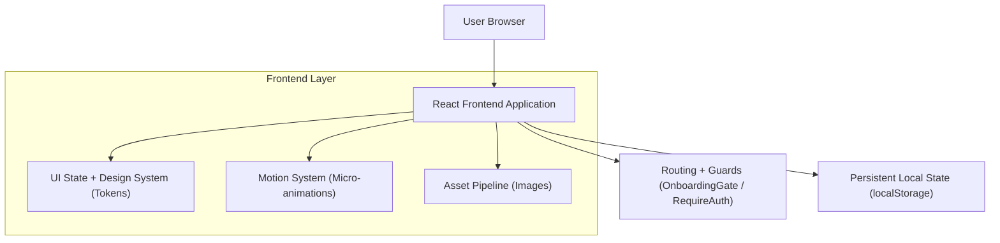

## 1.Architecture design

## 2.Technology Description
- Frontend: React@18 + vite + tailwindcss@3
- Routing: react-router-dom
- State/UI feedback: zustand (toast/snackbar + busy flags)
- Design system: Tailwind theme (design token) + componenti riusabili (Button/Card/Badge)
- Micro-animazioni: Tailwind transitions + CSS keyframes (skeleton/press/hover), con supporto `prefers-reduced-motion` (eventuale uso di framer-motion solo se servono transizioni complesse)
- Images: generazione on-the-fly via endpoint `text_to_image` (URL), con aspect ratio fisso (es. 16:9)
- Backend: Invariato / fuori scope (nessuna nuova API richiesta per i requisiti UI)

## 3.Route definitions
| Route | Purpose |
|-------|---------|
| /onboarding | Onboarding guidato a step (auth required) |
| / | Home (schermata principale) con contenuti e azioni primarie |
| /login | Login + eventuale switch Demo |
| /app/* | Area autenticata con layout e navigazione |

**Guard/Flow**
- `RequireAuth`: protegge `/app/*` e `/onboarding`.
- `OnboardingGate`: se utente autenticato ma onboarding non completato, redirect a `/onboarding`.

**Compatibilità PWA**
- Workbox configurato per aggiornare cache e ridurre casi di chunk “vecchi” dopo deploy.

## 6.Data model(if applicable)
Per questi requisiti non è necessario introdurre nuove entità dati lato backend.

**Local Storage (client)**
- `lifepet:onboardingCompleted`: `"1"` quando onboarding completato.
- `lifepet:activePetId`: id del pet attivo persistito tra refresh.

**Stato UI/Feedback**
- Toast store: stack di notifiche temporizzate, click-to-dismiss.
- Pattern interazione: `try/catch/finally` + flag `busy` per prevenire doppi invii.

**UX invarianti**
- Qualunque azione asincrona deve gestire: `loading` (disable), `success` (toast), `error` (toast + retry dove possibile).
- Motion invariants: durate/easing uniformi (150–250ms), animazioni non bloccanti, rispetto di `prefers-reduced-motion`.
