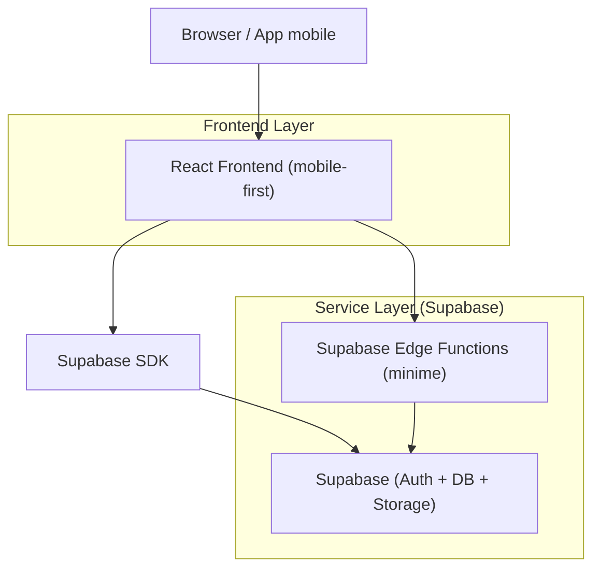
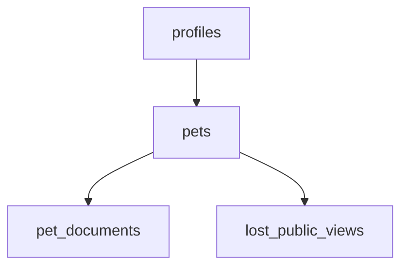

## 1.Architecture design


## 2.Technology Description
- Frontend: React@18 + TypeScript + vite + tailwindcss@3 (UI mobile-first)
- Backend: Supabase (Auth, Postgres, Storage) + Edge Functions (solo per operazioni privilegiate)

## 3.Route definitions
| Route | Purpose |
|-------|---------|
| / | Home: riepilogo pet e CTA principali |
| /auth/login | Login |
| /auth/register | Registrazione |
| /auth/reset | Recupero password |
| /onboarding | Setup iniziale + avvio creazione pet |
| /pets/new | Crea pet |
| /pets/:petId | Profilo pet + documenti |
| /pets/:petId/lost | Gestione modalità smarrimento (attiva/disattiva, link/QR) |
| /l/:publicToken | Pagina pubblica smarrimento (accesso anonimo) |

## 4.API definitions (If it includes backend services)
### 4.1 Tipi condivisi (TypeScript)
```ts
export type Pet = {
  id: string;
  owner_id: string;
  name: string;
  species: "dog" | "cat" | "other";
  photo_url?: string;
  notes?: string;
  is_lost: boolean;
  created_at: string;
  updated_at: string;
};

export type PetDocument = {
  id: string;
  pet_id: string;
  owner_id: string;
  doc_type: "vaccination" | "microchip" | "passport" | "other";
  file_path: string;
  doc_date?: string;
  created_at: string;
};

export type LostPublicView = {
  public_token: string;
  pet_id: string;
  pet_name: string;
  species: string;
  photo_url?: string;
  instructions: string;
  updated_at: string;
};
```

Operazioni essenziali (via Supabase SDK / Edge Function solo se necessario):
- Attivazione smarrimento (set `is_lost=true` + generazione/rotazione `public_token`)
- Recupero pagina pubblica da `public_token`

## 6.Data model(if applicable)
### 6.1 Data model definition


Entità (FK logiche, senza vincoli fisici):
- profiles: (id, email, created_at)
- pets: (id, owner_id, name, species, photo_url, notes, is_lost, created_at, updated_at)
- pet_documents: (id, pet_id, owner_id, doc_type, file_path, doc_date, created_at)
- lost_public_views: (public_token, pet_id, instructions, updated_at)

### 6.2 Data Definition Language
```sql
-- PETS
CREATE TABLE pets (
  id UUID PRIMARY KEY DEFAULT gen_random_uuid(),
  owner_id UUID NOT NULL,
  name TEXT NOT NULL,
  species TEXT NOT NULL,
  photo_url TEXT,
  notes TEXT,
  is_lost BOOLEAN NOT NULL DEFAULT FALSE,
  created_at TIMESTAMPTZ NOT NULL DEFAULT NOW(),
  updated_at TIMESTAMPTZ NOT NULL DEFAULT NOW()
);

-- PET DOCUMENTS
CREATE TABLE pet_documents (
  id UUID PRIMARY KEY DEFAULT gen_random_uuid(),
  pet_id UUID NOT NULL,
  owner_id UUID NOT NULL,
  doc_type TEXT NOT NULL,
  file_path TEXT NOT NULL,
  doc_date DATE,
  created_at TIMESTAMPTZ NOT NULL DEFAULT NOW()
);

-- PUBLIC LOST VIEW (token pubblico)
CREATE TABLE lost_public_views (
  public_token TEXT PRIMARY KEY,
  pet_id UUID NOT NULL,
  instructions TEXT NOT NULL,
  updated_at TIMESTAMPTZ NOT NULL DEFAULT NOW()
);

-- RLS (indicativo):
ALTER TABLE pets ENABLE ROW LEVEL SECURITY;
ALTER TABLE pet_documents ENABLE ROW LEVEL SECURITY;
ALTER TABLE lost_public_views ENABLE ROW LEVEL SECURITY;

-- Grants (linee guida):
GRANT SELECT ON pets TO anon;
GRANT ALL PRIVILEGES ON pets TO authenticated;
GRANT SELECT ON pet_documents TO anon;
GRANT ALL PRIVILEGES ON pet_documents TO authenticated;
GRANT SELECT ON lost_public_views TO anon;
GRANT ALL PRIVILEGES ON lost_public_views TO authenticated;
```

## 7.Roadmap tecnica (sicurezza, stabilità, mobile-first)
**Fase 0 — Fondazioni (1–2 settimane)**
- Setup repo, TypeScript, linting, error boundary, logging client.
- Supabase: Auth, schema tabelle, Storage bucket privato per documenti.
- RLS: accesso proprietario su `pets` e `pet_documents`; lettura anonima solo per `lost_public_views`.

**Fase 1 — Flussi core (2–4 settimane)**
- Login/Registrazione/Reset password.
- Onboarding + Crea pet.
- Gestione documenti: upload, lista, download, delete (con policy Storage coerenti).

**Fase 2 — Smarrimento (1–2 settimane)**
- Attiva/Disattiva smarrimento.
- Pagina pubblica `/l/:publicToken` con contenuti minimizzati.
- Rotazione token e invalidazione (Edge Function se utile per ridurre rischio di enumerazione).

**Fase 3 — Hardening produzione (2–3 settimane)**
- Rate limiting lato Edge Function (solo dove necessario) e protezioni anti-abuso.
- Audit events minimi (creazione pet, upload documento, toggle smarrimento).
- Strategie di resilienza UI: retry controllati, stati offline/poor network, upload con progress e ripresa.
- Test: unit (logica), e2e (flussi chiave), controlli regressione.

**Fase 4 — Stabilità operativa (continuo)**
- Sentry (o equivalente) per crash/error tracking.
- Monitoraggio performance (LCP/CLS), bundle size budget, immagini ottimizzate.
