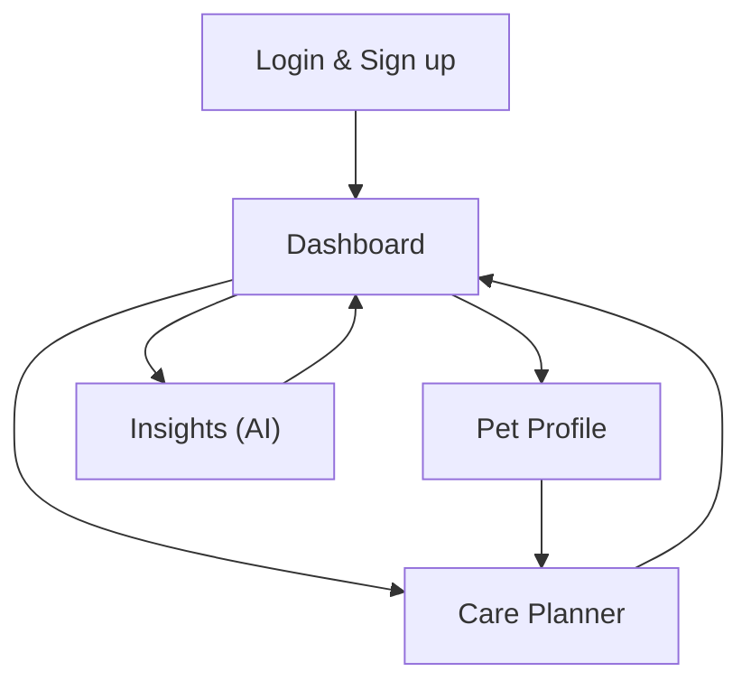

## 1. Product Overview
LifePet is a pet companion app that helps you track care routines, health history, and daily needs for one or more pets.
It turns logs into actionable reminders and AI-assisted insights so you can keep pets healthy with less guesswork.

## 2. Core Features

### 2.1 User Roles
| Role | Registration Method | Core Permissions |
|------|---------------------|------------------|
| Pet Owner | Email/password or OAuth | Manage own pets, logs, tasks, AI insights, export data |
| Household Member (optional) | Invite link | View/edit shared pets, complete tasks |

### 2.2 Feature Module
Our LifePet requirements consist of the following main pages:
1. **Dashboard**: pet switcher, today’s tasks, recent logs, quick add.
2. **Pet Profile**: pet details, medical info, timeline, attachments.
3. **Care Planner**: routines, one-off tasks, reminders, completion history.
4. **Insights (AI)**: summaries, anomaly flags, recommended next steps, chat.
5. **Login & Sign up**: authentication, password reset.

### 2.3 Page Details
| Page Name | Module Name | Feature description |
|-----------|-------------|---------------------|
| Login & Sign up | Auth | Create account, sign in, reset password, sign out |
| Dashboard | Pet switcher | Select active pet; show shared pets you can access |
| Dashboard | Today view | List due tasks/reminders; mark complete; quick add log/task |
| Dashboard | Recent activity | Show recent logs/events; open detail drawer |
| Pet Profile | Pet info | View/edit pet basics (name, species, breed, DOB, weight baseline) |
| Pet Profile | Medical | Record vet, allergies, meds, vaccinations; upload documents |
| Pet Profile | Timeline | Filterable feed of logs/events (food, meds, symptoms, vet visits) |
| Care Planner | Routines | Create/edit recurring schedules; pause/resume; set reminder times |
| Care Planner | Tasks | Create one-off tasks; assign to household member; complete/undo |
| Insights (AI) | Summaries | Generate weekly/monthly summary from logs; save to history |
| Insights (AI) | Recommendations | Produce actionable suggestions tied to logs (non-diagnostic disclaimer) |
| Insights (AI) | Chat | Ask questions about your pet’s history; cite used log entries |

## 3. Core Process
**Owner Flow**: Sign up → create first pet → add baseline info → add routines (food/meds/walks) → log events → complete daily tasks → review AI summary and recommendations → export/share with vet if needed.

**Household Member Flow (optional)**: Accept invite → choose pet → see assigned tasks → mark complete → add logs with notes/photos.

## 4. Phased MVP → Pro Roadmap
- **MVP (build-first, 4–6 weeks)**: Auth; single-owner pets; routines+tasks; basic logs; dashboard today view; file upload; AI weekly summary (manual trigger); basic export (PDF/CSV).
- **V1 (team-ready)**: household sharing + roles; richer log types; reminders tuning; AI chat grounded in your logs; anomaly heuristics (weight/appetite changes); audit trail.
- **Pro (monetization)**: multi-pet advanced analytics; automated AI summaries; vet-sharing links; integrations (wearables/feeds) if available; premium templates (puppy/kitten/senior care); priority AI limits/quotas.