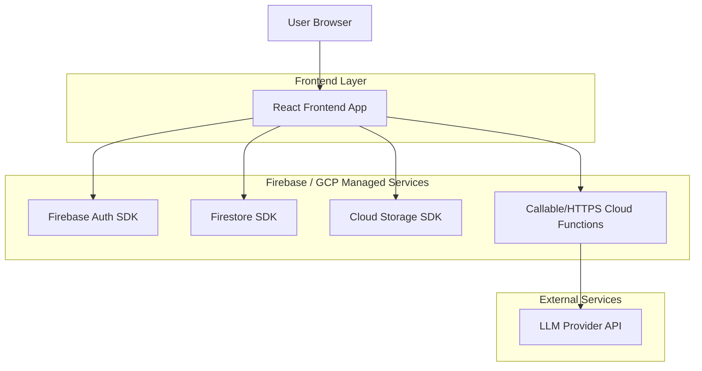
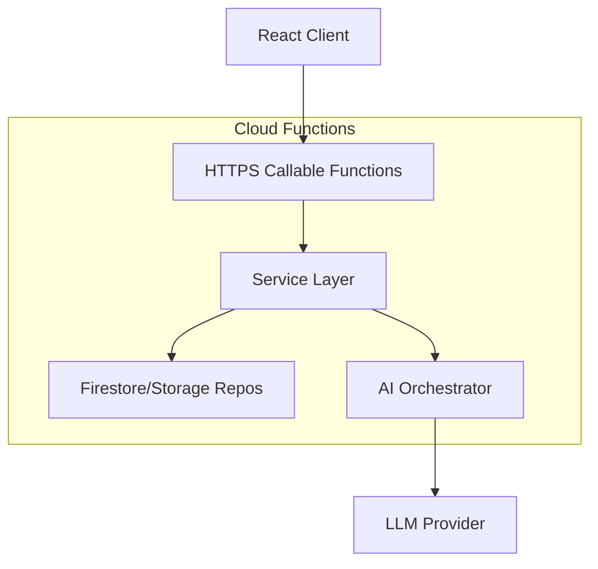

## 1.Architecture design


## 2.Technology Description
- Frontend: React@18 + TypeScript + vite + tailwindcss@3
- Backend: Firebase (Firestore, Auth, Storage) + Cloud Functions (Node.js/TypeScript)
- AI: LLM provider via server-side key in Cloud Functions (e.g., OpenAI/Anthropic)

## 3.Route definitions
| Route | Purpose |
|-------|---------|
| /login | Sign in / sign up / reset password |
| /app | Authenticated shell + navigation |
| /app/dashboard | Today view, recent activity, quick add |
| /app/pets/:petId | Pet profile, medical, timeline |
| /app/planner | Routines, tasks, reminders |
| /app/insights | AI summaries, recommendations, chat |
| /app/settings | Profile, household, billing (Pro) |

## 4.API definitions (Cloud Functions)
### 4.1 AI endpoints (HTTPS callable preferred)
- `aiGenerateSummary(petId, range)` → Create weekly/monthly summary grounded in user logs.
- `aiGenerateCarePlan(petId, goals)` → Suggest routine template (owner approves before saving).
- `aiChat(petId, conversationId, message)` → Grounded Q&A over pet data; returns citations.

### 4.2 Utility endpoints
- `inviteHouseholdMember(petId, email)` → Create invite token + email link.
- `onTaskDue` (scheduled) → Push notification/email reminders (if enabled).
- `onLogWrite` (trigger) → Update aggregates (lastFedAt, weightTrend, anomalyFlags).

### 4.3 Shared TypeScript types (front+functions)
```ts
export type PetId = string;
export type UserId = string;

export type Pet = {
  id: PetId;
  ownerId: UserId;
  sharedWith?: Record<UserId, "editor" | "viewer">;
  name: string;
  species: "dog" | "cat" | "other";
  breed?: string;
  dob?: string; // ISO
  createdAt: number; // ms
};

export type LogEvent = {
  id: string;
  petId: PetId;
  createdBy: UserId;
  type: "food" | "med" | "symptom" | "weight" | "vet" | "note";
  occurredAt: number;
  note?: string;
  value?: { amount?: number; unit?: string; tags?: string[] };
  attachmentUrls?: string[];
};
```

## 5.Server architecture diagram (Cloud Functions)


## 6.Data model (Firestore)
### 6.1 Collection model (logical)
- `users/{userId}`: profile, plan, notification prefs.
- `pets/{petId}`: ownerId, sharedWith map, basics.
- `pets/{petId}/logs/{logId}`: events (food/med/symptom/weight/vet/note).
- `pets/{petId}/tasks/{taskId}`: one-off tasks with status + assignee.
- `pets/{petId}/routines/{routineId}`: recurrence rules, nextRunAt.
- `pets/{petId}/conversations/{conversationId}` and `.../messages/{messageId}`.
- `pets/{petId}/ai_jobs/{jobId}`: async AI requests, status, outputs.

Recommended indexes (examples):
- logs: (petId, occurredAt desc), (type, occurredAt desc)
- tasks: (petId, dueAt asc, status)

### 6.2 Firestore Security Rules (baseline)
```rules
rules_version = '2';
service cloud.firestore {
  match /databases/{database}/documents {
    function isSignedIn() { return request.auth != null; }
    function isOwner(pet) { return pet.data.ownerId == request.auth.uid; }
    function canAccessPet(pet) {
      return isOwner(pet) || (pet.data.sharedWith[request.auth.uid] in ['viewer','editor']);
    }

    match /users/{userId} {
      allow read, write: if isSignedIn() && request.auth.uid == userId;
    }

    match /pets/{petId} {
      allow read: if isSignedIn() && canAccessPet(resource);
      allow create: if isSignedIn() && request.resource.data.ownerId == request.auth.uid;
      allow update, delete: if isSignedIn() && isOwner(resource);

      match /{sub=**}/{docId} {
        allow read: if isSignedIn() && canAccessPet(get(/databases/$(database)/documents/pets/$(petId)));
        allow write: if isSignedIn() && (
          isOwner(get(/databases/$(database)/documents/pets/$(petId))) ||
          get(/databases/$(database)/documents/pets/$(petId)).data.sharedWith[request.auth.uid] == 'editor'
        );
      }
    }
  }
}
```

Cloud Storage rules (attachments under pet scope):
```rules
rules_version = '2';
service firebase.storage {
  match /b/{bucket}/o {
    match /pets/{petId}/{allPaths=**} {
      allow read, write: if request.auth != null; // tighten by mirroring Firestore pet access via custom claims if needed
    }
  }
}
```

## 7.Build-ready implementation plan (modules)
### 7.1 Frontend modules
- `auth/`: session, protected routes, login UI.
- `appShell/`: desktop nav (left sidebar), pet switcher.
- `pets/`: pet CRUD, shared access UI.
- `logs/`: log composer, timeline, filters.
- `planner/`: routines+tasks, due list, completion.
- `insights/`: summary viewer, recommendations, chat.
- `data/`: Firestore repositories, converters, caching, optimistic updates.

### 7.2 Cloud Functions modules
- `ai/`: prompt builders, grounding (fetch logs), response parsing, safety.
- `triggers/`: onWrite aggregation, scheduled reminders.
- `household/`: invites, role checks.
- `billing/` (Pro): plan limits, Stripe webhooks (optional).

### 7.3 Phased delivery checklist
- MVP: core collections + rules; task/routine CRUD; log timeline; summary function; minimal triggers.
- V1: sharing; chat + citations; scheduled reminders; aggregation/anomaly flags.
- Pro: quotas/usage tracking; billing; automation; advanced analytics.