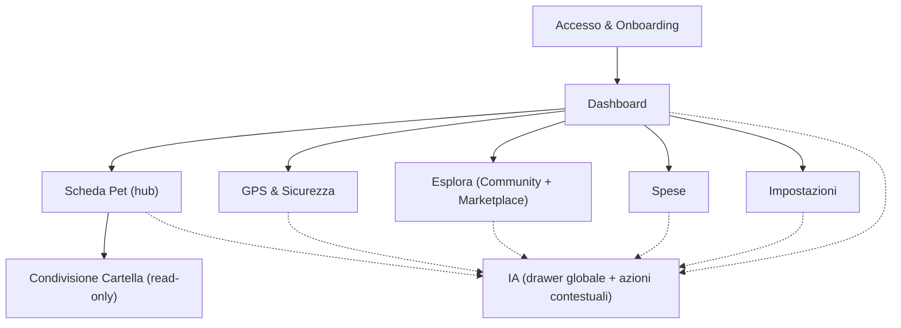

## 1. Product Overview
LifePet è un’app per gestire più animali in un unico spazio (salute, agenda, GPS, spese, community e marketplace).
Obiettivo: una **dashboard più semplice e bella**, palette **celeste**, animazioni coerenti e **IA integrata ovunque** senza rimuovere alcuna feature.

## 2. Core Features

### 2.1 User Roles
| Ruolo | Metodo registrazione | Permessi principali |
|------|-----------------------|---------------------|
| Utente | Email/Password o provider social | Gestisce pet e dati; usa community/marketplace; abilita GPS; usa IA contestuale |
| Moderatore (opz.) | Assegnazione | Modera contenuti e segnalazioni (community/marketplace) |

### 2.2 Feature Module
Pagine essenziali:
1. **Accesso & Onboarding**: login/registrazione, recupero, tour guidato.
2. **Dashboard**: panoramica “pulita”, 3–6 card principali con CTA, prossime scadenze, alert chiari.
3. **Scheda Pet (hub)**: anagrafica, salute/timeline, alimentazione, agenda/promemoria, training, documenti.
4. **GPS & Sicurezza**: tracking, storico, geofence, alert.
5. **Esplora (Community + Marketplace)**: feed, gruppi/chat, annunci, contatti.
6. **Spese**: inserimento, categorie, budget, trend.
7. **Impostazioni**: privacy/consensi, notifiche, export/cancellazione, preferenze IA.
8. **Condivisione Cartella (read-only)**: accesso tramite link a scadenza.

### 2.3 Page Details
| Page Name | Module Name | Feature description |
|---|---|---|
| Accesso & Onboarding | Autenticazione | Eseguire login/registrazione; gestire reset password e logout. |
| Accesso & Onboarding | Onboarding a step | Guidare 3–6 step (crea pet, consensi); salvare completamento; riavviare da Impostazioni. |
| Dashboard | Layout semplificato | Mostrare 1 “Pet attivo” + **Prossime azioni**; visualizzare 3–6 card funzioni; ridurre CTA duplicate (1 primaria per sezione). |
| Dashboard | Stati & feedback | Gestire loading/skeleton, empty state (nessun pet → CTA crea), error con retry; prevenire doppi invii. |
| Dashboard | IA ovunque (entry point) | Aprire pannello/drawer IA globale; proporre azioni contestuali (es. “Riepiloga ultimi 30 giorni”, “Suggerisci prossime azioni”). |
| Scheda Pet (hub) | Dati pet | Creare/modificare/eliminare pet; gestire foto, specie/razza, note, ID/microchip, contatti veterinario. |
| Scheda Pet (hub) | Salute & longevità | Registrare eventi (vaccini/visite/terapie/sintomi/allergie); consultare timeline e trend; mostrare score/indicatori non diagnostici. |
| Scheda Pet (hub) | Agenda & promemoria | Creare/modificare scadenze e ricorrenze; marcare completati; inviare notifiche; export ICS. |
| Scheda Pet (hub) | Alimentazione & benessere | Registrare log (cibo/acqua/attività/peso); mostrare progress e alert; stime kcal/grammi come supporto informativo. |
| Scheda Pet (hub) | Training & comportamento | Creare task/routine; tracciare progress/streak. |
| Scheda Pet (hub) | Documenti | Caricare/preview/scaricare referti/ricette/passaporto; collegare ai record. |
| Tutte le pagine | IA contestuale (cross-cutting) | Offrire comandi IA in contesto (riassunti, chiarimenti, suggerimenti); **mostrare sempre disclaimer**: “informazioni generali, non sostituisce il veterinario”. |
| GPS & Sicurezza | Tracking & geofence | Visualizzare posizione e storico; definire aree sicure; inviare alert fuori zona; gestire consenso/opt-in. |
| Esplora | Community | Pubblicare post (testo/foto), commentare/like; gruppi e chat; segnalazioni. |
| Esplora | Marketplace | Cercare/filtrare; creare annuncio con foto/prezzo; contatto base; gestione media. |
| Esplora | Moderazione (se ruolo) | Gestire segnalazioni e azioni (ban/timeout/rimozione contenuti). |
| Spese | Budget & report | Inserire spese, categorie e ricorrenti; impostare budget; vedere totali e trend. |
| Impostazioni | Privacy, dati, IA | Gestire consensi (GPS/community), notifiche; export/cancellazione; preferenze IA (attiva/disattiva, finestra contesto). |
| Condivisione Cartella | Link read-only | Generare link a scadenza; mostrare cartella clinica/documenti in sola lettura. |

## 3. Core Process
Flusso Utente: onboarding → accesso → crea/seleziona pet → usa dashboard (azioni rapide) → gestisce salute/agenda/alimentazione/training/documenti → (opz.) abilita GPS → (opz.) usa community/marketplace → registra spese → usa IA contestuale in ogni sezione → gestisce privacy ed export/cancellazione in Impostazioni.

