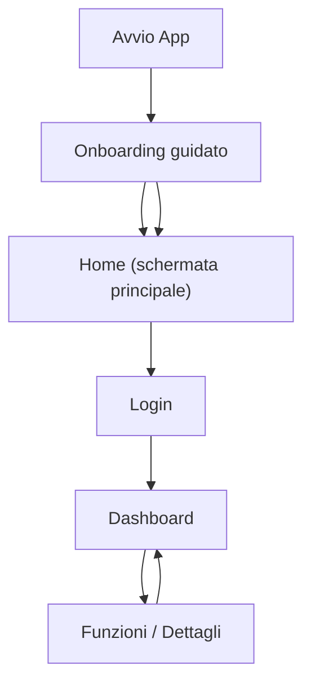

## 1. Product Overview
Migliorare l’esperienza d’uso di LifePet rendendo l’app più semplice, fluida e prevedibile.
Focus su: UX “facile” (gerarchia chiara e feedback), palette più ricca e coerente (non solo azzurro), micro-animazioni leggere e consistenti.

**Definition of Done (DoD)**
- Ogni elemento cliccabile produce un risultato: navigazione, azione eseguita, o messaggio chiaro (toast/banner) con cosa fare.
- Ogni azione asincrona mostra stato: `loading` (spinner + disable), `success` (toast), `error` (toast + retry dove possibile).
- UI “facile”: per ogni sezione esiste 1 CTA primaria evidente; azioni secondarie non bloccano il flusso.
- Palette e componenti: colori/token definiti e applicati in modo consistente (stati default/hover/pressed/disabled/error/success).
- Micro-animazioni: press/hover su controlli, transizioni leggere tra sezioni, skeleton/placeholder coerenti; supporto a `prefers-reduced-motion`.
- Onboarding a step: persistente e riavviabile da Impostazioni.
- Pet e dati: creazione/salvataggio funzionante in modalità demo e in modalità Firebase; pet attivo persistente tra refresh.

## 2. Core Features

### 2.1 Feature Module
Le funzionalità richieste consistono nelle seguenti pagine principali:
1. **Onboarding guidato**: percorso a step, permessi/consensi, tour UI, completamento.
2. **Home (schermata principale)**: navigazione chiara, contenuti principali con immagini, azioni primarie con feedback.
3. **Dashboard (post-login)**: card con immagini e CTA per entrare velocemente nelle funzioni.
4. **Dettaglio contenuto**: visualizzazione ordinata, immagini e azioni contestuali con stati (loading/success/error).
5. **Persistenza pet**: pet attivo e dati legati al pet sempre coerenti.

### 2.3 Page Details
| Page Name | Module Name | Feature description |
|-----------|-------------|---------------------|
| Onboarding guidato | Percorso a step | Guidare l’utente con 3–6 step massimi (progressivo) e pulsanti Avanti/Indietro/Salta sempre funzionanti. |
| Onboarding guidato | Step con immagini | Ogni step include immagine coerente, titolo, 2–4 bullet e (quando utile) CTA verso una pagina reale dell’app. |
| Onboarding guidato | Stato e ripresa | Salvare completamento onboarding e forzare `/onboarding` al primo accesso in area `/app/*`. |
| Onboarding guidato | Reset | Permettere avvio/reset da Impostazioni in qualsiasi momento. |
| Home (schermata principale) | Gerarchia azioni | Mostrare 1 CTA primaria per sezione; ridurre azioni duplicate e raggruppare le secondarie in menu contestuale. |
| Home (schermata principale) | Feedback pulsanti | Dare feedback immediato a ogni pressione: hover/pressed + micro-animazione (100–200ms), spinner su azioni asincrone, disabilitazione anti-doppio tap, conferma successo (toast/snackbar) o errore con retry. **AC:** nessun doppio invio; stato visivo sempre visibile. |
| Home (schermata principale) | Contenuti con immagini | Visualizzare card con immagine coerente (dimensioni uniformi, placeholder/skeleton in caricamento) e fallback se immagine assente. |
| Home (schermata principale) | Ordinamento visivo | Allineare griglie e spaziature, ridurre rumore (separators leggeri), usare titoli e sottotitoli consistenti. **AC:** spacing e tipografia coerenti tra sezioni; nessun “salto” layout in caricamento (skeleton). |
| Dashboard | Card con immagini | Mostrare 3–6 card “hero” con immagine, descrizione breve e CTA “Apri” per le funzioni principali. |
| Dashboard | CTA sempre attive | Quando non è possibile eseguire un’azione (es. pet mancante), mostrare messaggio esplicito e CTA per risolvere (crea/seleziona pet). |
| Dettaglio contenuto | Layout ordinato | Mostrare immagine hero o galleria, titolo e metadati, sezioni con heading, e azioni contestuali in area dedicata. |
| Dettaglio contenuto | Stati di interazione | Gestire stati loading/empty/error, e fornire retry; mostrare conferme esplicite dopo azioni (es. “Salvato”). |
| Dettaglio contenuto | Accessibilità base | Assicurare contrasto con palette (multi-colore), focus visibile da tastiera, aree cliccabili ampie e testi leggibili. **AC:** contrasto minimo AA; `prefers-reduced-motion` riduce/elimina animazioni non essenziali. |
| Persistenza pet | Pet attivo | Salvare `activePetId` localmente e ripristinarlo all’avvio; se non valido, selezionare il primo pet disponibile. |
| Persistenza pet | Salvataggio dati | Ogni creazione/modifica deve confermare con toast e gestire errori con messaggio chiaro. |

## 4. Requisiti UX (clickability)
- Nessun bottone deve risultare “morto”: se un’azione non è disponibile, mostrare un messaggio esplicito e offrire una soluzione (es. CTA “Crea pet”).
- Le azioni critiche devono essere sempre `type="button"` (o `type="submit"` solo nei form), per evitare submit involontari.

## 4.1 Requisiti UI (palette + micro-animazioni)
- Palette: definire 1 colore primario + 2–3 accenti (es. energia, cura, progresso) e usarli in modo consistente su badge, CTA secondarie, stati (success/warn/error).
- Stati: ogni componente interattivo ha varianti `default/hover/pressed/focus/disabled/loading` con token dedicati.
- Micro-animazioni (coerenti):
  - Button/card: hover (elevazione/ombra), pressed (scale 0.98–0.99), focus ring.
  - Navigazione: transizione tra pagine/section (fade/slide leggero, 150–250ms).
  - Loading: skeleton/placeholder (no “layout shift”).
- Accessibilità motion: rispettare `prefers-reduced-motion` (disattivare transizioni non essenziali).

## 5. Requisiti Salvataggio Pet
- Creazione pet: valida input (nome obbligatorio) e mostra `success`/`error` toast.
- Pet attivo: viene persistito localmente; al riavvio deve essere ripristinato.
- Se `activePetId` non esiste più, selezionare automaticamente il primo pet disponibile.
- In demo mode: salvataggio su storage locale (demoDb) coerente con la UX.

## 3. Core Process
Flusso utente (generale):
1. Apri l’app → se è il primo accesso, vedi Onboarding guidato.
2. Completi o salti il tour → arrivi alla Home.
3. Accedi → arrivi alla Dashboard con card immagini e CTA.
4. Se non hai pet, la UI guida a crearlo; altrimenti puoi usare tutte le funzioni.
5. In ogni schermata, ogni pulsante fornisce feedback immediato (visivo + stato) e impedisce doppi invii.

## 6. Criteri di accettazione (MVP UX + colori + micro-animazioni)
- Clickability: 0 controlli “morti”; se disabilitato, mostra motivazione + next step.
- Feedback async: per ogni azione asincrona esiste `loading` + `success/error`; in errore è presente un retry dove sensato.
- UX facile: in Home e Dashboard la CTA primaria per sezione è riconoscibile entro 1 secondo (titolo + azione).
- Palette: componenti e badge usano token coerenti; nessun colore “random” fuori palette.
- Motion: micro-animazioni uniformi (stessa durata/easing); nessuna animazione invasiva > 250ms.
- A11y: focus visibile; con `prefers-reduced-motion` le animazioni decorative sono disattivate.

## 7. Stato implementazione (2026-04)

- Clickability: nessun bottone “morto”; se un’azione non è disponibile mostra toast con next-step.
- Onboarding: gate automatico su `/app/*`, percorso a step con immagini, skip/fine e ripresa da Impostazioni.
- Persistenza pet: pet attivo ripristinato e gestione fallback se ID non valido.
- Immagini: hero/card coerenti su Home/Login e immagini header su pagine principali (auto-fallback se mancante prompt).
- QA: lint + unit test + build + Playwright e2e verdi.
