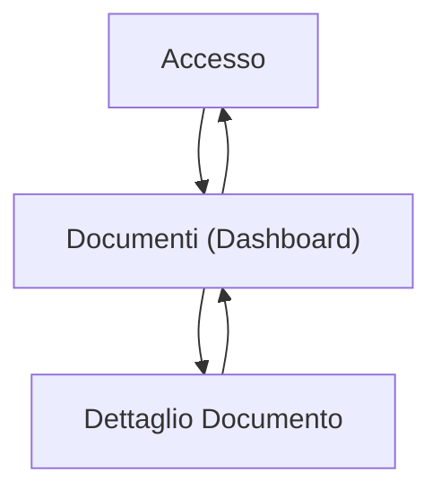

## 1. Product Overview
Gestione Documenti è un’app web per salvare, organizzare e ritrovare rapidamente documenti, con accesso controllato e supporto offline.
È pensata per team piccoli/medi e singoli professionisti che vogliono un flusso semplice: carica → organizza → cerca → condividi.

## 2. Core Features

### 2.1 User Roles
| Ruolo | Metodo di registrazione | Permessi principali |
|------|--------------------------|---------------------|
| Utente autenticato | Email + password (Supabase Auth) | Caricare e gestire i propri documenti; usare ricerca; abilitare offline; condividere con altri utenti secondo regole di permesso |

### 2.2 Feature Module
I requisiti consistono nelle seguenti pagine principali:
1. **Accesso**: login/registrazione; recupero password.
2. **Documenti (Dashboard)**: caricamento e salvataggio; organizzazione (cartelle/tag); ricerca; preferiti/recente; gestione offline/backup; gestione condivisioni.
3. **Dettaglio Documento**: visualizzazione/preview; modifica metadati; versioni; permessi e condivisione; download e disponibilità offline.

### 2.3 Page Details
| Page Name | Module Name | Feature description |
|-----------|-------------|---------------------|
| Accesso | Login / Registrazione | Autenticare con email+password; creare nuovo account; mostrare errori validazione; mantenere sessione attiva |
| Accesso | Recupero password | Inviare link di reset; confermare esito richiesta |
| Documenti (Dashboard) | Caricamento & Salvataggio | Caricare file (drag&drop e selezione); assegnare titolo e descrizione minima; salvare file in archivio; mostrare avanzamento e stato upload |
| Documenti (Dashboard) | Libreria & Navigazione | Mostrare elenco documenti (recente, preferiti); ordinare (data, nome); visualizzare cartelle; entrare in cartella; breadcrumb |
| Documenti (Dashboard) | Organizzazione (Cartelle & Tag) | Creare/rinominare/spostare in cartella; aggiungere/rimuovere tag; filtrare per tag e cartella |
| Documenti (Dashboard) | Ricerca | Cercare per nome e metadati; suggerire risultati mentre digiti; applicare filtri (tag, cartella, proprietario/condivisi) |
| Documenti (Dashboard) | Condivisi con me | Mostrare documenti condivisi; indicare ruolo (lettura/modifica); aprire dettaglio documento |
| Documenti (Dashboard) | Offline & Backup | Abilitare modalità offline per documenti selezionati; mostrare stato cache e ultimo sync; eseguire “backup” come export scaricabile (manifest + file) |
| Documenti (Dashboard) | Gestione permessi (rapida) | Condividere documento selezionato con utenti (email); impostare livello (lettura/modifica); revocare accesso; mostrare riepilogo accessi |
| Dettaglio Documento | Preview & Download | Visualizzare preview (quando supportata) o fallback download; scaricare file; mostrare info base (nome, dimensione, owner, aggiornato) |
| Dettaglio Documento | Metadati & Organizzazione | Modificare titolo/descrizione; cambiare cartella; gestire tag; salvare modifiche |
| Dettaglio Documento | Versioni | Caricare nuova versione; elencare versioni; ripristinare una versione precedente; mostrare note versione (opzionali) |
| Dettaglio Documento | Permessi & Condivisione | Invitare utenti; impostare ruolo (lettura/modifica); revocare accesso; mostrare chi ha accesso e da quando |
| Dettaglio Documento | Disponibilità Offline | Rendere disponibile offline; mostrare stato cache; risolvere conflitti con ultima modifica (regola “ultima scrittura” + avviso) |

## 3. Core Process
**Flusso Utente (unico ruolo: Utente autenticato)**
1. Accedi o registrati.
2. Nella Dashboard, carichi un documento e assegni almeno un titolo; opzionalmente scegli cartella e tag.
3. Ritrovi i documenti tramite ricerca e filtri (cartella/tag/recente/condivisi).
4. Apri un documento per vedere preview, modificare metadati o caricare una nuova versione.
5. Condividi il documento con un altro utente impostando permesso (lettura o modifica), e puoi revocarlo in qualsiasi momento.
6. Se ti serve lavorare senza rete, abiliti l’offline per documenti specifici e controlli lo stato di sincronizzazione.
7. Per “backup”, esporti un pacchetto scaricabile dalla Dashboard (utile per archiviazione locale o trasferimento).

