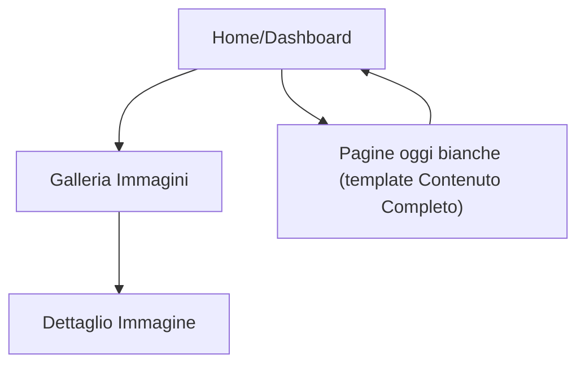

## 1. Product Overview
Rendere l’app LifePet “viva”: immagini reali sempre visibili e nessuna pagina vuota.
L’obiettivo è sostituire placeholder/pagine bianche con contenuti completi, utili e coerenti in-app.

## 2. Core Features

### 2.1 Feature Module
Le modifiche richieste consistono nelle seguenti pagine principali:
1. **Home/Dashboard**: anteprime con immagini reali, accesso rapido alle sezioni, stati di caricamento/errore.
2. **Galleria Immagini**: griglia immagini reali, caricamento progressivo, fallback quando manca un’immagine.
3. **Pagina “Contenuto Completo” (template per pagine oggi bianche)**: header + descrizione + blocchi informativi + call to action + FAQ breve.

### 2.2 Page Details
| Page Name | Module Name | Feature description |
|-----------|-------------|---------------------|
| Home/Dashboard | Hero + Quick actions | Mostrare riassunto e azioni principali; evidenziare sezioni con card e immagini reali (no placeholder bianchi). |
| Home/Dashboard | Card con anteprima immagini | Caricare immagini reali (da asset o URL) con skeleton; gestire errori e immagini mancanti con fallback coerente. |
| Home/Dashboard | Stati UI (loading/empty/error) | Sostituire “schermo bianco” con: skeleton, empty-state con istruzioni, error-state con retry. |
| Galleria Immagini | Griglia immagini | Visualizzare immagini reali in card; lazy-load; mantenere aspect ratio e ritaglio (cover/contain) definito. |
| Galleria Immagini | Dettaglio immagine (modal/pagina) | Aprire immagine in grande con metadati essenziali (titolo, data, origine) e azioni minime (download/copia link se disponibile). |
| Galleria Immagini | Fallback media | Mostrare immagine di fallback e messaggio quando l’URL è invalido o l’asset manca; loggare l’errore lato client. |
| Template “Contenuto Completo” | Struttura contenuti | Mostrare sempre: titolo, sottotitolo, corpo a sezioni (card), “Cosa puoi fare qui”, e link/CTA verso l’azione più utile. |
| Template “Contenuto Completo” | Contenuti guidati | Spiegare in 3–5 punti l’utilità della pagina; includere esempi minimi (testo) quando non ci sono dati utente. |
| Template “Contenuto Completo” | Supporto in-page | Aggiungere blocco “Problemi comuni” + “Come iniziare” + “Contatta/Segnala” (link interno o azione). |

## 3. Core Process
**Flusso principale (utente):**
1) Apri Home/Dashboard e vedi subito card con immagini reali e skeleton durante il loading.
2) Entri in una sezione: se mancano dati, vedi un empty-state con istruzioni e CTA (non una pagina bianca).
3) Apri Galleria Immagini, esplori la griglia, apri un dettaglio e, se un media manca, vedi un fallback chiaro con possibilità di retry.

