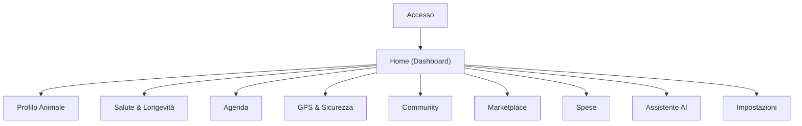

## 1. Product Overview
LifePet è un’app mobile per gestire più animali domestici in un unico posto: salute, agenda, sicurezza GPS, spese e servizi.
Integra community, marketplace e insight su longevità con supporto AI.

## 2. Core Features

### 2.1 User Roles
| Ruolo | Metodo registrazione | Permessi principali |
|------|-----------------------|---------------------|
| Utente | Email/Password o provider social (Firebase Auth) | Gestisce animali, dati salute/agenda/GPS/spese, pubblica in community, compra/vende nel marketplace, usa AI |
| Moderatore (opz.) | Invito/assegnazione | Modera contenuti e segnalazioni community/marketplace |

### 2.2 Feature Module
1. **Accesso**: login, registrazione, recupero account.
2. **Home (Dashboard)**: selettore multi-animale, riepiloghi (salute/agenda/spese), scorciatoie AI e sezioni.
3. **Profilo Animale**: anagrafica, tag/ID, documenti, impostazioni specifiche.
4. **Salute & Longevità**: cartella clinica, vaccini/terapie, visite, indicatori e timeline; stime/insight longevità.
5. **Agenda**: calendario, promemoria (vaccini/medicine/visite), notifiche.
6. **GPS & Sicurezza**: posizione, storico, aree sicure, condivisione posizione (opt-in).
7. **Community**: feed, post, commenti, like, segnalazioni.
8. **Marketplace**: catalogo, schede annuncio, pubblicazione annuncio, chat/contatto base.
9. **Spese**: inserimento spese, categorie, budget mensile, riepiloghi.
10. **Assistente AI**: Q&A su dati dell’animale, riepiloghi, suggerimenti (non diagnostici).
11. **Impostazioni**: profilo, privacy/consensi, notifiche, esportazione/cancellazione dati.

### 2.3 Page Details
| Page Name | Module Name | Feature description |
|-----------|-------------|---------------------|
| Accesso | Autenticazione | Eseguire login/registrazione; gestire reset password e logout |
| Home (Dashboard) | Multi-animale + Overview | Selezionare animale; mostrare stato salute, prossimi eventi, KPI spese, scorciatoie a sezioni |
| Profilo Animale | Dati base | Creare/modificare animale (specie, razza, nascita, peso, foto); gestire documenti e note |
| Salute & Longevità | Cartella clinica | Registrare eventi (vaccini, farmaci, visite, allergie); allegare file; visualizzare timeline |
| Salute & Longevità | Insight longevità | Calcolare e mostrare indicatori (trend peso/attività, aderenza terapie); mostrare stime e raccomandazioni generali |
| Agenda | Calendario + reminder | Creare/modificare eventi; impostare ricorrenze; inviare notifiche push/local |
| GPS & Sicurezza | Tracking + geofence | Visualizzare posizione; salvare storico; definire aree sicure e avvisi; abilitare/disabilitare con consenso |
| Community | Social feed | Pubblicare post (testo/foto); commentare; mettere like; segnalare contenuti |
| Marketplace | Annunci | Cercare/filtrare; vedere dettagli; creare annuncio con foto/prezzo; contattare venditore (chat base) |
| Spese | Budget & report | Inserire spese; categorizzare; impostare budget; vedere totali e trend |
| Assistente AI | Chat + riepiloghi | Chattare su “dati del mio pet”; generare riepiloghi (es. ultimi 30 giorni); mostrare disclaimer non medico |
| Impostazioni | Account & privacy | Gestire profilo, consensi GPS/community, notifiche; esportare e cancellare dati |

## 3. Core Process
Flusso Utente: ti registri → crei 1+ animali → inserisci dati salute e imposti promemoria → abiliti GPS (se vuoi) → usi community/marketplace → registri spese → consulti insight longevità e chiedi supporto all’AI.

