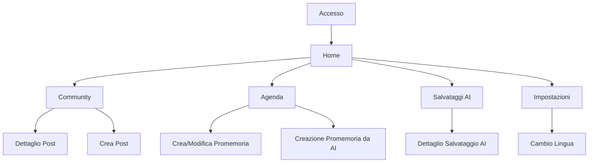

## 1. Product Overview
LifePet è un’app (UI in italiano) con community e agenda personale, arricchita da funzioni AI.
Ti permette di salvare in modo affidabile output AI e creare promemoria anche generati dall’AI, con cambio lingua dalle impostazioni.

## 2. Core Features

### 2.1 User Roles
| Ruolo | Metodo di registrazione | Permessi principali |
|------|--------------------------|---------------------|
| Utente autenticato | Email + password / magic link | Pubblicare e commentare, gestire agenda e promemoria, usare AI e consultare salvataggi, impostare lingua |
| Visitatore (anon) | Nessuno | Navigare contenuti pubblici della community (sola lettura) |

### 2.2 Feature Module
Il prodotto richiede le seguenti pagine principali:
1. **Home**: panoramica rapida (community + agenda), accesso rapido alle azioni chiave.
2. **Community**: feed post, dettaglio post con commenti, creazione post.
3. **Agenda**: calendario, lista promemoria, creazione/modifica promemoria (manuale o da AI).
4. **Salvataggi AI**: elenco salvataggi, dettaglio/recupero, stato affidabilità (riuscito/fallito/ritentato).
5. **Impostazioni**: cambio lingua (IT default + altre), preferenze base.
6. **Accesso**: login/registrazione e recupero sessione.

### 2.3 Page Details
| Page Name | Module Name | Feature description |
|-----------|-------------|---------------------|
| Accesso | Autenticazione | Effettuare login/registrazione; ripristinare sessione; uscire (logout). |
| Home | Navigazione principale | Mostrare header con link: Home, Community, Agenda, Salvataggi AI, Impostazioni; mostrare stato sessione. |
| Home | Sintesi Community | Visualizzare anteprima feed (ultimi post) e link al feed completo. |
| Home | Sintesi Agenda | Visualizzare prossimi promemoria (oggi/7gg) e link al calendario. |
| Community | Feed | Elencare post ordinati per data; aprire dettaglio post. |
| Community | Dettaglio post | Visualizzare contenuto post e commenti; aggiungere commento; mostrare autore e data. |
| Community | Crea post | Creare un post con titolo/testo; pubblicare e tornare al feed. |
| Agenda | Calendario | Navigare per mese/settimana; selezionare giorno; evidenziare giorni con promemoria. |
| Agenda | Promemoria | Creare/modificare/eliminare promemoria con titolo, descrizione, data/ora; impostare promemoria/notifica. |
| Agenda | Creazione da AI | Inserire una richiesta testuale; generare proposta promemoria via AI; confermare e salvare in agenda. |
| Salvataggi AI | Elenco | Visualizzare tutti i salvataggi AI con data, tipo e stato (ok/errore); filtrare per stato. |
| Salvataggi AI | Dettaglio salvataggio | Aprire un salvataggio; copiare/riusare contenuto; vedere prompt e metadati essenziali. |
| Salvataggi AI | Affidabilità salvataggi | Salvare in modo atomico (richiesta + risultato + stato); ritentare salvataggi falliti; prevenire duplicati. |
| Impostazioni | Lingua | Cambiare lingua UI; salvare preferenza; applicare al refresh e alle nuove sessioni. |

## 3. Core Process
**Flusso Utente (autenticato)**
1) Accedi o registrati.
2) Da Home scegli: (a) Community per leggere/creare post, (b) Agenda per vedere calendario e gestire promemoria, (c) Salvataggi AI per rivedere output AI.
3) In Agenda puoi creare un promemoria manualmente oppure chiedere all’AI di proporre un promemoria: confermi e lo salvi.
4) Ogni output AI rilevante viene salvato in “Salvataggi AI” con uno stato; se fallisce, puoi ritentare.
5) In Impostazioni cambi lingua e l’app applica la preferenza.

**Flusso Visitatore (anon)**
1) Entra in app.
2) Naviga la community in sola lettura.
3) Per pubblicare o usare agenda/AI, esegui accesso.

