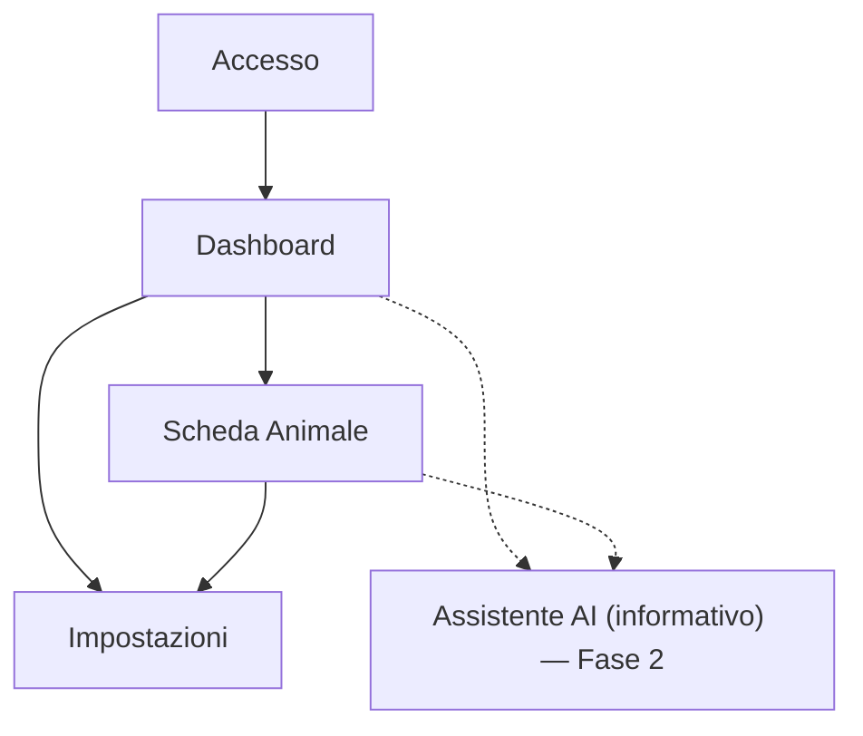

## 1. Product Overview
LifePet ti aiuta a gestire **più animali** in un unico spazio: anagrafica, salute e promemoria.
Include un assistente AI **solo informativo** con disclaimer (non sostituisce il veterinario).

## 2. Core Features

### 2.1 User Roles
| Ruolo | Metodo registrazione | Permessi principali |
|------|-----------------------|---------------------|
| Utente | Email/Password (SSO opzionale) | Crea e gestisce più animali; registra eventi salute; imposta promemoria; carica documenti; usa AI informativa |

### 2.2 Feature Module
LifePet include già i seguenti moduli (con livelli Free/Pro quando applicabile):
1. **Dashboard**: panoramica stato pet, promemoria, trend.
2. **Profilo Animale avanzato**: anagrafica, foto, peso/crescita, carattere, alimentazione, patologie/allergie, microchip/ID, contatti vet.
3. **Cartella clinica digitale**: timeline unificata (salute, log, task, documenti) + condivisione read-only a scadenza.
4. **Alimentazione intelligente**: stime kcal/grammi + promemoria pasti + supporto AI informativo.
5. **Salute**: eventi, vaccini, terapie, referti e note.
6. **Monitoraggio benessere**: log (cibo/acqua/attività/peso) + alert intelligenti.
7. **Agenda**: eventi e ricorrenze + export ICS.
8. **Training & comportamento**: task e routine di training + progress/streak.
9. **GPS & sicurezza**: tracking, storico, geofence + alert fuori zona.
10. **Community**: feed, commenti, gruppi chat + moderazione.
11. **Marketplace**: annunci e media.
12. **Spese**: budget, analisi, ricorrenti.
13. **Longevità & indice salute**: score (verde/giallo/rosso) e suggerimenti.
14. **Notifiche**: promemoria e alert.

### 2.3 Page Details
| Page Name | Module Name | Feature description |
|-----------|-------------|---------------------|
| Accesso | Autenticazione | Eseguire login/registrazione; gestire reset password e logout |
| Dashboard | Selettore multi-animale | Selezionare animale attivo; visualizzare elenco animali e accesso rapido alla scheda |
| Dashboard | Panoramica | Mostrare prossimi promemoria (es. visite/vaccini/farmaci) e ultimi eventi salute per animale |
| Scheda Animale | Anagrafica | Creare/modificare/eliminare un animale; gestire foto, specie/razza, data nascita, peso, note |
| Scheda Animale | Salute (timeline) | Registrare eventi (vaccino, visita, terapia, allergia, sintomo); allegare note/file; filtrare e consultare cronologia |
| Scheda Animale | Promemoria | Creare/modificare promemoria con data/ora e ricorrenza; marcare come completati |
| Scheda Animale | Documenti | Caricare/visualizzare/scaricare documenti (referti, ricette, passaporto) |
| Impostazioni | Privacy & dati | Gestire consensi; esportare dati; richiedere cancellazione account/dati |
| Assistente AI (informativo) — Fase 2 | Chat + riassunti | Porre domande sui dati inseriti; generare riepiloghi (es. ultimi 30 giorni); **mostrare sempre disclaimer**: “informazioni generali, non consulenza veterinaria” |

## 3. Core Process
Flusso Utente (MVP): ti registri → crei **2+ animali** (multi‑animale) → inserisci eventi salute e documenti → crei promemoria (anche ricorrenti) → consulti dashboard → esporti o cancelli i dati dalle impostazioni.

Flusso Utente (Fase 2): dalla dashboard o dalla scheda animale apri l’**Assistente AI informativo** per ottenere riepiloghi e informazioni generali (disclaimer sempre visibile).

## 4. MVP e Roadmap

### 4.1 MVP (4–6 feature)
1. **Autenticazione account**: login/registrazione, reset password, logout.
2. **Gestione multi‑animale**: creare/modificare/eliminare animali, foto e dati base.
3. **Registro salute**: eventi (vaccino/visita/terapia/allergia/sintomo) in timeline con note e allegati.
4. **Promemoria**: scadenze con data/ora e ricorrenza; completamento.
5. **Documenti**: upload/preview/download (referti, ricette, passaporto).

### 4.2 Roadmap a fasi (requisiti chiari)
- **Fase 1 — MVP**
  - Multi-animale completo + profilo avanzato.
  - Cartella clinica digitale + documenti.
  - Promemoria/routine (pasti, training, farmaci).
  - Sicurezza: isolamento per proprietario.
- **Fase 2 — AI informativa (nutrizione + sintomi)**
  - Disclaimer sempre visibile.
  - Contesto dai dati inseriti (ultimi N giorni).
  - Rate-limit + preferenze AI in Impostazioni.
- **Fase 3 — Sicurezza & condivisione**
  - Link condivisi con allegati via URL firmati a scadenza.
  - Profili pubblici community + avatar.
- **Fase 4 — Community & moderazione**
  - Moderazione post/commenti/chat, ban/timeout, code di revisione.
- **Fase 5 — Benessere avanzato**
  - Alert intelligenti (idratazione, attività, geofence) + indice salute.
