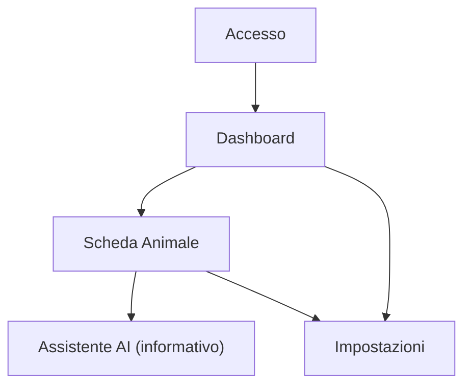

## 1. Product Overview
LifePet ti aiuta a gestire **più animali** in un unico spazio: anagrafica, salute e promemoria.
Include un assistente AI **solo informativo** con disclaimer (non sostituisce il veterinario).

## 2. Core Features

### 2.1 User Roles
| Ruolo | Metodo registrazione | Permessi principali |
|------|-----------------------|---------------------|
| Utente | Email/Password (SSO opzionale) | Crea e gestisce più animali; registra eventi salute; imposta promemoria; carica documenti; usa AI informativa |

### 2.2 Feature Module
Le funzionalità essenziali sono organizzate nelle seguenti pagine:
1. **Accesso**: login, registrazione, recupero password.
2. **Dashboard**: selezione animale attivo; panoramica prossimi promemoria; scorciatoie alle schede animali.
3. **Scheda Animale**: gestione multi-animale (crea/modifica/elimina); dati base; salute (eventi e timeline); promemoria; documenti.
4. **Assistente AI (informativo)**: Q&A e riassunti basati sui dati inseriti; disclaimer obbligatorio; nessuna diagnosi/terapia.
5. **Impostazioni**: profilo, privacy, esportazione/cancellazione dati.

### 2.3 Page Details
| Page Name | Module Name | Feature description |
|-----------|-------------|---------------------|
| Accesso | Autenticazione | Eseguire login/registrazione; gestire reset password e logout |
| Dashboard | Selettore multi-animale | Selezionare animale attivo; visualizzare elenco animali e accesso rapido alla scheda |
| Dashboard | Panoramica | Mostrare prossimi promemoria (es. visite/vaccini/farmaci) e ultimi eventi salute per animale |
| Scheda Animale | Anagrafica | Creare/modificare/eliminare un animale; gestire foto, specie/razza, data nascita, peso, note |
| Scheda Animale | Salute (timeline) | Registrare eventi (vaccino, visita, terapia, allergia, sintomo); allegare note/file; filtrare e consultare cronologia |
| Scheda Animale | Promemoria | Creare/modificare promemoria con data/ora e ricorrenza; marcare come completati |
| Scheda Animale | Documenti | Caricare/visualizzare/scaricare documenti (referti, ricette, passaporto) |
| Assistente AI (informativo) | Chat + riassunti | Porre domande sui dati inseriti; generare riepiloghi (es. ultimi 30 giorni); **mostrare sempre disclaimer**: “informazioni generali, non consulenza veterinaria” |
| Impostazioni | Privacy & dati | Gestire consensi; esportare dati; richiedere cancellazione account/dati |

## 3. Core Process
Flusso Utente: ti registri → crei **2+ animali** (multi‑animale) → inserisci eventi salute e documenti → crei promemoria ricorrenti → consulti dashboard → se serve, chiedi all’AI un riepilogo o informazioni generali (con disclaimer) → esporti o cancelli i dati dalle impostazioni.

