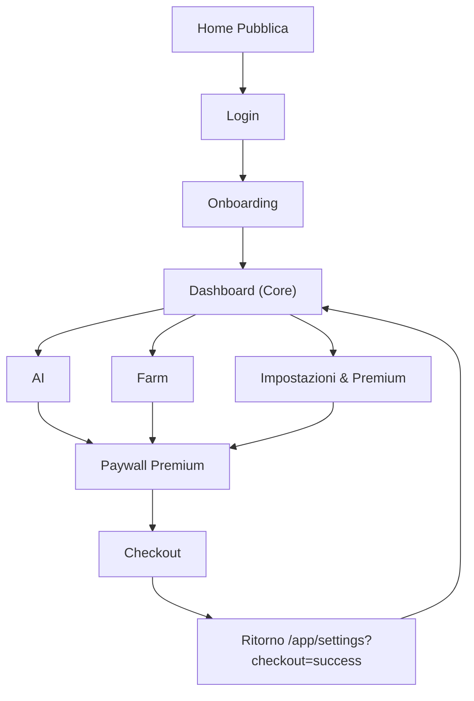

## 1. Product Overview
PetLyon Premium rende chiara la navigazione (core vs secondaria vs farm) e introduce un paywall coerente per le funzionalità Pro.
Obiettivo: aumentare conversione a Pro senza interrompere i flussi core.

## 2. Core Features

### 2.1 User Roles
| Ruolo | Metodo di registrazione | Core Permissions |
|------|--------------------------|------------------|
| Free | Login (Firebase Auth) | Usa funzioni core, vede CTA Premium, accede a Farm/AI dove permesso o con limiti |
| Pro (Premium) | Upgrade via checkout | Sblocca funzioni Pro, limiti più alti, accesso completo a moduli “Premium” |

### 2.2 Feature Module
1. **Dashboard (Home App)**: navigazione IA (Core/Secondaria/Farm), stato piano (Free/Pro), accesso rapido ai moduli principali.
2. **AI**: entrypoint unico + sotto-sezioni; gestione blocchi/limiti e CTA upgrade quando necessario.
3. **Farm**: area separata con shell dedicata e navigazione interna; accesso dal livello “Farm” della IA.
4. **Impostazioni & Premium**: gestione account + sezione “Piano” (stato, upgrade, gestione abbonamento).
5. **Login/Onboarding**: autenticazione e gate iniziale.

### 2.3 Page Details
| Page Name | Module Name | Feature description |
|---|---|---|
| Dashboard (Home App) | IA/Navigazione | Mostrare 3 livelli: Core (primario), Secondaria (ridotta), Farm (separata) con label coerenti e ricerca voce menu. |
| Dashboard (Home App) | Stato Piano | Mostrare badge “Free”/“Pro”, CTA “Passa a Premium” se Free, deep link a sezione Piano. |
| AI | Accesso & Gating | Consentire accesso; se limite/quota o feature Pro -> mostrare paywall/CTA con ritorno al punto d’origine. |
| Farm | Entrata Area Farm | Aprire FarmShellLayout; mantenere “switch Pet/Farm” (contesto) e breadcrumb/label “Reparto: Farm”. |
| Impostazioni & Premium | Piano & Pagamenti | Visualizzare stato billing, avviare checkout, aprire portale gestione, gestire success/cancel callback. |
| Login/Onboarding | Autenticazione | Consentire login e redirect ai percorsi /app; mantenere gate onboarding senza bloccare l’upgrade. |

## 3. Core Process
**Flusso Free → Premium (Upgrade):**
1) Sei in una pagina (Core/Secondaria/AI/Farm) e tocchi una funzione Pro o raggiungi un limite.
2) Vedi un paywall leggero (benefici + prezzo + CTA).
3) Avvii checkout; al ritorno vedi stato aggiornato “Pro” e riprendi il flusso dal punto d’origine.

**Flusso Navigazione IA:**
1) Core sempre visibile e prioritario.
2) Secondaria ridotta (meno rumore), accessibile via “Altro”/search.
3) Farm come area separata (cambio contesto) con navigazione interna dedicata.

