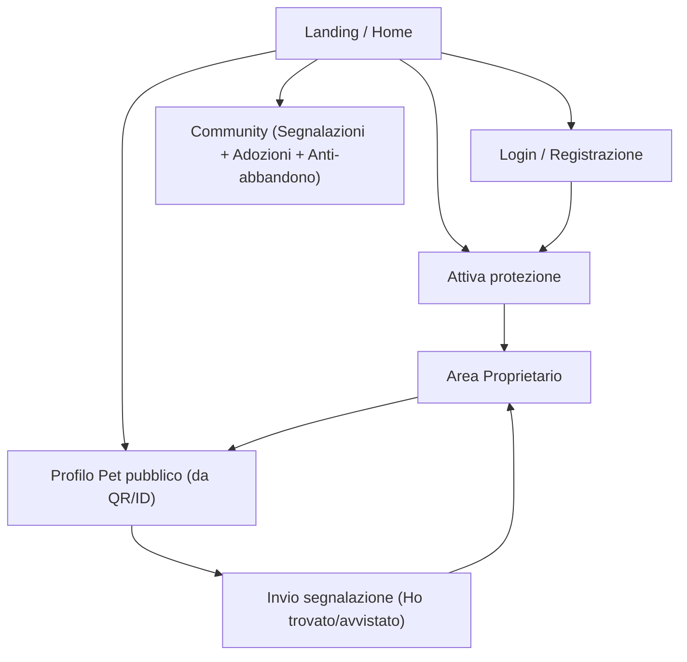

## 1. Product Overview
PetLyon evolve in una piattaforma centrata sul ritrovamento animali e la prevenzione smarrimenti/abbandoni, con identificazione QR/ID “Pet Protetto”, documenti in cloud, community di segnalazioni e adozioni.
Obiettivo: aumentare la probabilità di ricongiungimento e creare un ecosistema utile a proprietari e cittadini.

### Obiettivo finale (messaggio guida)
- Non perdere mai più il tuo animale.
- Non perdere mai più i suoi documenti.
- Ritrovarlo facilmente in caso di smarrimento.
- Rendere l’abbandono molto più difficile e facilmente tracciabile.
- Aiutare adozioni e svuotamento canili.

## 2. Core Features

### 2.1 User Roles
| Ruolo | Registration Method | Core Permissions |
|------|---------------------|------------------|
| Visitatore (anon) | Nessuna | Può visualizzare profili pubblici da QR/ID, inviare segnalazioni (ritrovamento/avvistamento/abbandono), consultare bacheca adozioni |
| Proprietario | Email + verifica | Può attivare “Pet Protetto”, gestire profili pet e QR/ID, caricare documenti cloud, pubblicare/gestire segnalazioni e annunci adozione |

### 2.2 Feature Module
La piattaforma è composta dalle seguenti pagine principali:
1. **Landing / Home**: nuova Hero orientata al ritrovamento, CTA “Attiva protezione”, accesso rapido a “Segnala ritrovamento” e “Adozioni”.
2. **Login / Registrazione**: autenticazione per proprietari.
3. **Attiva protezione**: flusso guidato per creare profilo pet, associare QR/ID “Pet Protetto” e impostare contatti.
4. **Area Proprietario**: gestione pet protetti, documenti cloud, stato smarrimento e segnalazioni.
5. **Profilo Pet pubblico (da QR/ID)**: pagina pubblica con info essenziali e azioni “Ho trovato” / “Ho avvistato”.
6. **Community (Segnalazioni + Adozioni + Anti-abbandono)**: feed e pubblicazione contenuti, filtri e dettagli.

### 2.2.1 Priorità sviluppo
1. Hero chiaro (ritrovamento + documenti)
2. Sistema Pet Protetto (QR + ID)
3. Documenti digitali
4. Segnalazioni + community
5. Adozioni
6. Fiducia (numeri + testimonianze)

### 2.3 Page Details
| Page Name | Module Name | Feature description |
|-----------|-------------|---------------------|
| Landing / Home | Hero “Non perdere mai più” | Titoli: “Non perdere mai più il tuo animale” + “E non perdere mai più i suoi documenti”. Sottotitolo: “PetLyon protegge il tuo pet, conserva tutti i suoi dati e ti aiuta a ritrovarlo in caso di smarrimento”. CTA: “Scarica gratis” e “Registra il tuo animale”. |
| Landing / Home | Sezione “Come funziona” | Spiegare in 3 step: attiva → applica QR/ID → in caso di ritrovamento contatto rapido. |
| Landing / Home | Sistema “Pet Protetto PetLyon” | Badge 🛡️ “Pet Protetto PetLyon” + sotto-badge “Tracciabile / Identificabile / Documenti sempre disponibili”. Messaggio: “Se il tuo animale è registrato su PetLyon, sarà sempre riconducibile a te”. |
| Landing / Home | Documenti digitali | Titolo: “Non perdere mai più i documenti del tuo cane”. Funzioni: libretto sanitario, vaccini, visite, upload PDF/foto, accesso rapido. Messaggio: “Tutto sempre con te, in un unico posto sicuro”. |
| Landing / Home | Community + Segnalazioni | Segnala smarrito/trovato, posizione su mappa, notifiche agli utenti vicini. Messaggio: “Una community che protegge gli animali insieme”. |
| Landing / Home | Adozioni | Titolo: “Aiutiamo a svuotare i canili”. Card animali disponibili + pulsante “Adotta”. Messaggio: “Dai una casa a chi ne ha bisogno”. |
| Landing / Home | Anti-abbandono | Titolo: “Contro l’abbandono”. Testo: “PetLyon rende ogni animale registrato riconducibile al proprietario, aiutando a prevenire e contrastare l’abbandono”. |
| Landing / Home | Trust & social proof | Mostrare numeri/benefici e mini FAQ (privacy contatti, cosa vede chi scansiona). |
| Login / Registrazione | Auth | Consentire accesso/creazione account proprietario e recupero password. |
| Attiva protezione | Wizard setup | Guidare: (1) dati pet + foto, (2) contatti proprietario e preferenze privacy, (3) associazione QR/ID “Pet Protetto”, (4) riepilogo e attivazione. |
| Attiva protezione | Conferma attivazione | Mostrare stato “Protetto”, link al profilo pubblico e istruzioni stampa/applicazione QR. |
| Area Proprietario | Gestione pet | Elencare pet, creare/modificare profilo, gestire stato (normale/smarrito) e informazioni pubbliche. |
| Area Proprietario | Documenti cloud | Caricare/visualizzare/eliminare documenti (es. libretto, vaccini) e impostare visibilità (privato / condivisibile via link). |
| Area Proprietario | Segnalazioni | Creare/chiudere segnalazione smarrimento, vedere segnalazioni ricevute (ritrovamento/avvistamento) collegate al proprio pet. |
| Profilo Pet pubblico (da QR/ID) | Scheda pet pubblica | Mostrare foto, nome, info essenziali, stato (es. “Smarrito”), indicazioni rapide per chi trova. |
| Profilo Pet pubblico (da QR/ID) | Azioni di contatto | Permettere invio “Ho trovato” o “Ho avvistato” con: posizione opzionale, nota, contatto del segnalante. |
| Profilo Pet pubblico (da QR/ID) | Storico eventi | Mostrare storico minimale (es. “Segnalazione inviata”, “Pet marcato smarrito”, “Risolto”) per tracciabilità. |
| Profilo Pet pubblico (da QR/ID) | Sicurezza/Privacy | Mostrare solo contatti consentiti dal proprietario e note di sicurezza (es. non trattenere il pet se aggressivo). |
| Community | Feed Segnalazioni | Consultare e pubblicare segnalazioni (avvistamento/ritrovamento/abbandono) con filtri base (tipo, area). |
| Community | Bacheca Adozioni | Consultare e pubblicare annunci adozione con dettagli essenziali e contatto. |
| Community | Dettaglio contenuto | Aprire dettaglio (post) con dati completi e azioni minime (contatta / segnala). |

## 3. Core Process
**Proprietario – Attiva protezione**: dalla Landing selezioni “Attiva protezione” → se non autenticato effettui login/registrazione → compili il wizard (dati pet, contatti e privacy) → associ QR/ID “Pet Protetto” → confermi → visualizzi lo stato “Protetto” e accedi all’Area Proprietario.

**Proprietario – Smarrimento**: dall’Area Proprietario imposti il pet come “Smarrito” e aggiungi note utili → la pagina pubblica da QR mostra lo stato e le istruzioni → ricevi segnalazioni “Ho trovato/avvistato” in Area Proprietario.

**Visitatore – Ritrovamento tramite QR/ID**: scansioni QR o inserisci ID → apri Profilo Pet pubblico → premi “Ho trovato” o “Ho avvistato” → invii posizione/nota/contatto → il proprietario riceve la segnalazione.

**Flusso scansione (dettaglio)**
1. Scanner QR (camera) o inserimento ID.
2. Risoluzione `publicId` → scheda pet pubblica.
3. Call-to-action: contatto rapido proprietario (canali consentiti) e/o invio segnalazione.
4. Creazione evento in storico (audit leggero) per tracciabilità.

**Community – Adozioni e anti-abbandono**: accedi alla pagina Community → sfogli feed Segnalazioni o Bacheca Adozioni → pubblichi una segnalazione/annuncio con area e dettagli → gestisci/chiudi il contenuto.

