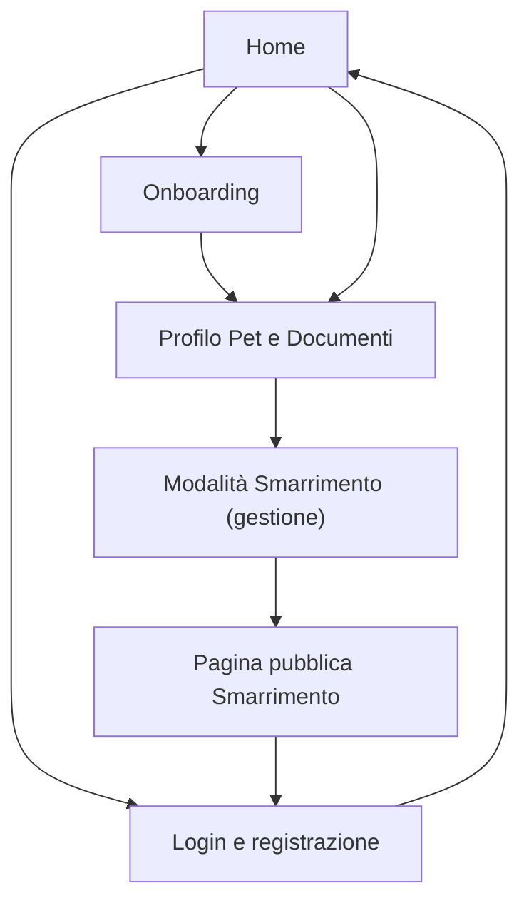

## 1. Product Overview
Petlion è un’identità digitale per il tuo pet: profilo, documenti e modalità “smarrito” consultabile rapidamente.
Ti aiuta a centralizzare dati affidabili e a velocizzare il ricongiungimento in caso di smarrimento.

## 2. Core Features

### 2.1 User Roles
| Ruolo | Metodo di registrazione | Permessi principali |
|------|--------------------------|---------------------|
| Utente | Email + password (o OAuth se disponibile) | Gestire profilo, creare/gestire pet, caricare/consultare documenti, attivare/disattivare smarrimento |
| Visitatore | Nessuno (accesso da link/QR “smarrito”) | Visualizzare pagina pubblica del pet smarrito e istruzioni di contatto (dati minimizzati) |

### 2.2 Feature Module
Petlion richiede le seguenti pagine principali:
1. **Home**: stato rapido (pet principali), accesso a crea pet/documenti/smarrito.
2. **Login e registrazione**: accesso, recupero password.
3. **Onboarding**: guida iniziale, creazione primo pet.
4. **Profilo Pet e Documenti**: anagrafica pet, documenti (lista + dettaglio), upload.
5. **Modalità Smarrimento (pubblica + gestione)**: attivazione, pagina pubblica da link/QR, disattivazione.

### 2.3 Page Details
| Page Name | Module Name | Feature description |
|-----------|-------------|---------------------|
| Home | Stato e navigazione | Mostrare riepilogo pet (nome/foto/stato smarrimento) e CTA principali (crea pet, documenti, smarrimento). |
| Login e registrazione | Autenticazione | Consentire login, registrazione e logout. Gestire reset password. |
| Onboarding | Setup iniziale | Guidare i passaggi minimi (profilo base) e avviare creazione del primo pet. Salvare progresso. |
| Profilo Pet e Documenti | Anagrafica pet | Creare/modificare dati pet (nome, specie, foto, note essenziali). |
| Profilo Pet e Documenti | Gestione documenti | Elencare documenti per pet. Caricare file e metadati minimi (tipo, data). Aprire/visualizzare/scaricare. Eliminare documento. |
| Modalità Smarrimento (pubblica + gestione) | Attivazione smarrimento | Attivare/disattivare “smarrito” per un pet, con conferma e data/ora. |
| Modalità Smarrimento (pubblica + gestione) | Pagina pubblica smarrimento | Mostrare info essenziali del pet e istruzioni di contatto, con privacy by default (no dati sensibili non necessari). |
| Modalità Smarrimento (pubblica + gestione) | Link/QR | Mostrare e copiare link pubblico (e QR) della pagina smarrimento del pet. |

## 3. Core Process
**Flusso Login**
1) Apri app → 2) Login/Registrazione → 3) Accesso a Home.

**Flusso Onboarding**
1) Primo accesso → 2) Schermate guida (2–4 step) → 3) Avvio “Crea pet” → 4) Salvataggio pet → 5) Ritorno a Home con pet creato.

**Flusso Crea Pet**
1) Da Home/Onboarding → 2) Inserisci dati minimi (nome, specie, foto opzionale) → 3) Salva → 4) Vai a Profilo Pet.

**Flusso Documenti**
1) Apri Profilo Pet → 2) Tab/Sezione Documenti → 3) Upload file + tipo documento + data → 4) Visualizza lista → 5) Apri dettaglio/scarica/elimina.

**Flusso Smarrimento**
1) Apri Profilo Pet → 2) Attiva Smarrimento → 3) Ottieni link/QR pubblico → 4) Visitatore apre link/QR → 5) Visualizza pagina smarrimento e istruzioni contatto → 6) Proprietario disattiva quando ritrovato.

