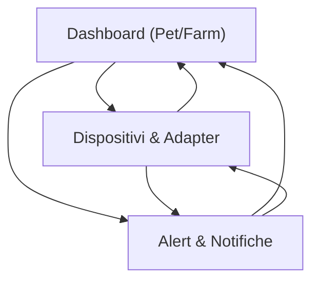

## 1. Product Overview
Modulo piattaforma multi‑specie (pet + bovini) per integrare device eterogenei tramite un DeviceAdapter astratto, normalizzare i dati e mostrare dashboard + alert/notifiche.
Include una mock demo end‑to‑end per simulare telemetria, regole e notifiche senza hardware.

## 2. Core Features

### 2.1 User Roles
| Ruolo | Metodo di accesso | Core Permissions |
|------|-------------------|------------------|
| Operatore (Pet) | Accesso applicazione (demo o account) | Vede dashboard pet, dispositivi associati, alert e notifiche |
| Operatore (Farm) | Accesso applicazione (demo o account) | Vede dashboard farm/bovini, dispositivi e alert di allevamento |
| Admin Tecnico | Accesso con permessi elevati | Configura DeviceAdapter, mapping modello dati, regole alert globali |

### 2.2 Feature Module
La piattaforma richiede le seguenti pagine principali:
1. **Dashboard (Pet/Farm)**: switch contesto, KPI, stato device, feed alert/notifiche.
2. **Dispositivi & Adapter**: registro device, selezione adapter, mapping dati unificato, stream telemetria, modalità demo.
3. **Alert & Notifiche**: regole (threshold), lista alert, storico eventi, centro notifiche.

### 2.3 Page Details
| Page Name | Module Name | Feature description |
|-----------|-------------|---------------------|
| Dashboard (Pet/Farm) | Selettore contesto | Passare tra vista “Pet” e “Farm” mantenendo lo stesso modello dati e componenti UI. |
| Dashboard (Pet/Farm) | KPI & Stato | Visualizzare indicatori essenziali: n. soggetti (pet/capi), device online/offline, ultimi valori anomali, alert aperti. |
| Dashboard (Pet/Farm) | Feed operativo | Mostrare ultimi alert e notifiche con filtri rapidi (critico/oggi/per soggetto). |
| Dispositivi & Adapter | Registro dispositivi | Elencare device, stato connessione, soggetto associato (pet o bovino), ultimo payload ricevuto. |
| Dispositivi & Adapter | DeviceAdapter astratto | Selezionare un “tipo adapter” e visualizzare contratto standard: `identify()`, `normalizeTelemetry()`, `capabilities()`, `validatePayload()`. |
| Dispositivi & Adapter | Modello dati unificato | Mappare payload specifici → campi normalizzati (es. temperatura, attività, geofence, ruminazione) e salvare mapping. |
| Dispositivi & Adapter | Mock demo end‑to‑end | Avviare generatore telemetria (pet + bovini), simulare device online/offline, produrre eventi che attivano regole. |
| Alert & Notifiche | Motore alert | Definire regole minime (soglia + finestra temporale + severità) e valutarle sui dati normalizzati. |
| Alert & Notifiche | Gestione alert | Vedere alert aperti/chiusi, aprire/chiudere, collegare alert a soggetto e device, aggiungere nota operatore. |
| Alert & Notifiche | Notifiche | Mostrare notifiche in‑app generate da alert (toast + inbox) con stato letto/non letto. |

## 3. Core Process
**Flusso Operatore (Pet/Farm)**
1. Entri in Dashboard e scegli contesto (Pet o Farm).
2. Controlli KPI e feed; apri un alert per vedere soggetto, device e ultimi valori.
3. Vai in “Dispositivi & Adapter” per verificare stato device e (in demo) avviare la simulazione.
4. Vai in “Alert & Notifiche” per creare/modificare regole e gestire gli alert generati.

**Flusso Admin Tecnico**
1. Entri in “Dispositivi & Adapter” e definisci/aggiorni tipi di adapter e mapping verso il modello unificato.
2. Verifichi in streaming i payload normalizzati e la coerenza dei campi.
3. Configuri regole alert base e controlli l’output nel centro notifiche.

