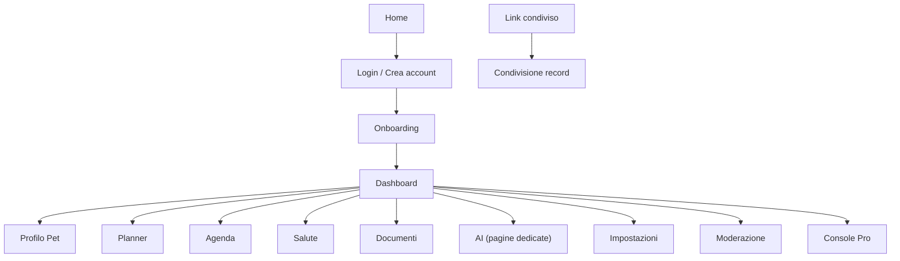

## 1. Product Overview
LifePet è un’app web per gestire routine, salute, documenti e attività del tuo pet, con supporto AI informativo.
Obiettivo redesign: rifare tutte le pagine con UI più moderna (animazioni), massima semplicità d’uso, efficienza e sicurezza.

## 2. Core Features

### 2.1 User Roles
| Ruolo | Metodo registrazione | Core Permissions |
|------|-----------------------|------------------|
| Utente | Email+password (Firebase) o Demo | Gestisce i propri pet e tutte le funzioni collegate al pet attivo |
| Provider (Pro) | Login + accesso area Pro | Usa Console Pro per operazioni dedicate ai servizi |
| Moderatore | Login + flag “moderators/{uid}” | Accede a Moderazione per gestione contenuti |

### 2.2 Feature Module
Le funzionalità sono organizzate con **una pagina dedicata per funzione**:
1. **Home**: presentazione, call-to-action, accesso.
2. **Login / Crea account**: autenticazione e reset password + accesso Demo.
3. **Onboarding**: completamento iniziale (es. primo pet) prima dell’uso.
4. **Dashboard**: panoramica, azioni rapide, promemoria.
5. **Esplora**: hub rapido alle funzioni.
6. **Profilo Pet**: creazione/selezione/gestione pet.
7. **Status**: stato sintetico del pet (indicatori/riassunti).
8. **Notifiche**: elenco alert e azioni (es. “segna letto”).
9. **Salute**: eventi salute e monitoraggio.
10. **Cartella clinica**: timeline e gestione record.
11. **Documenti**: upload, libreria, filtri, backup/export, metadati.
12. **Terapie**: gestione farmaci e piani.
13. **Vaccini**: scadenze e storico.
14. **Alimentazione**: log e note alimentari.
15. **Benessere**: log e indicatori benessere.
16. **Planner**: task e routine.
17. **Agenda**: eventi e promemoria.
18. **Training**: piani/attività training.
19. **Prenotazioni**: gestione appuntamenti.
20. **Spese**: registrazione e trend.
21. **GPS**: funzioni mappa/percorsi.
22. **Servizi vicini**: ricerca servizi sulla mappa.
23. **AI (pagine dedicate)**: Chat, Sintomi, Foto, Video, Riepilogo, Salvataggi.
24. **Community**: contenuti e gruppi.
25. **Adozioni**: consultazione/pubblicazione.
26. **Marketplace**: consultazione/pubblicazione.
27. **Impostazioni**: preferenze app.
28. **Condivisione record**: pagina pubblica via token.
29. **Console Pro**: pagina dedicata Pro.
30. **Moderazione**: pagina dedicata moderatori.
31. **Diagnostica (DEV)**: strumenti tecnici (solo sviluppo).

### 2.3 Page Details
| Page Name | Module Name | Feature description |
|---|---|---|
| Home | Marketing + CTA | Mostrare valore prodotto, portare a login/app |
| Login/Crea account | Auth | Autenticare, creare account, reset password, Demo |
| Onboarding | Setup | Guidare a completare onboarding prima di /app |
| Dashboard | Panoramica | Mostrare pet attivo, azioni rapide, prossime azioni, accesso funzioni |
| Esplora | Hub | Offrire accesso rapido a feature principali |
| Profilo Pet | Gestione pet | Creare/modificare pet, selezionare pet attivo |
| Status | Sintesi | Mostrare stato calcolato del pet e segnali principali |
| Notifiche | Alert | Elencare notifiche, segnare come lette |
| Salute | Eventi | Gestire/visualizzare eventi salute e monitoraggio |
| Cartella clinica | Timeline | Visualizzare e organizzare record clinici |
| Documenti | Archivio | Caricare, filtrare, aprire/scaricare, edit metadati, selezione bulk, backup |
| Terapie | Piani | Gestire terapie/farmaci del pet |
| Vaccini | Scadenze | Gestire vaccini, prossime scadenze |
| Alimentazione | Log | Registrare e consultare alimentazione/valori |
| Benessere | Log | Registrare e consultare indicatori benessere |
| Planner | Task | Creare/gestire task e routine, vedere scadenze |
| Agenda | Calendario | Creare/gestire eventi, vedere prossimi eventi |
| Training | Attività | Gestire attività e piani di training |
| Prenotazioni | Appuntamenti | Gestire prenotazioni/visite |
| Spese | Budget | Registrare spese e consultare riepiloghi |
| GPS | Mappa | Aprire mappa e funzioni legate a posizione/percorsi |
| Servizi vicini | Ricerca | Cercare punti/servizi su mappa |
| AI Chat | Conversazione | Chat AI informativa sul pet attivo, prompt rapidi |
| AI Sintomi | Triage | Flusso AI “Sintomi” con disclaimer e domande guidate |
| AI Foto/Video | Vision | Inviare allegati a AI (se abilitato) |
| AI Riepilogo | Insight | Generare sintesi/insight informativi |
| AI Salvataggi | Libreria | Consultare contenuti AI salvati |
| Community | Social | Consultare e pubblicare contenuti community |
| Adozioni | Annunci | Consultare e pubblicare annunci adozione |
| Marketplace | Annunci | Consultare e pubblicare annunci marketplace |
| Impostazioni | Preferenze | Gestire impostazioni app e account |
| Condivisione record | Public share | Aprire record condivisi via token |
| Console Pro | Pro tools | Funzioni dedicate ai provider |
| Moderazione | Safety | Gestire moderazione (solo moderatori) |
| Diagnostica (DEV) | Tools | Consultare strumenti diagnostici (DEV) |

## 3. Core Process
**Flusso Utente**: Home → Login (o Demo) → Onboarding (se non completato) → /app/dashboard → selezione pet → navigazione alle pagine funzione (una feature = una pagina).
**Flusso Moderatore**: Login → /app → accesso a Moderazione (solo se autorizzato).
**Flusso Condivisione**: link /share/:token → visualizzazione record condivisi.

